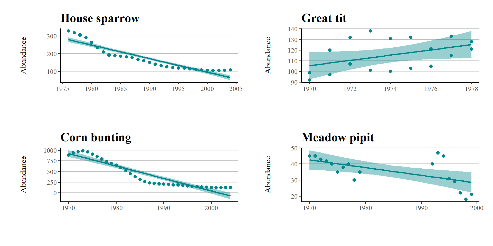

# (PART\*) DRY code {.unnumbered}


# Functions 


Most of the time when we work in R, we will use functions; often pre-written functions that we access from baseR or installed packages. But you can also write your own functions. Eventually you could even turn a collection of your own functions into a package (for yourself or others).

**Functions** make it easy to use sets of code instructions repeatedly (without filling our scripts with the code underlying the function) and help us carry out multiple tasks in a single step without having to go through the details of how the steps are executed.

If you need a refresher on what makes up a function [check here][last time](#functions).


## Structuring a function

R makes it easy to create user defined functions by using `function()`. Here is how it works:


```r
my_function_name <- function(my_args) {
  # code to run
  # return (some value)
}
```

* Give your function an object name and assign the function to it, e.g. `my_function_name <- function()`.

* Within the parentheses you specify inputs and arguments just like how pre-written functions work, e.g. `function(my_args)`.

* Next, put all the code you want your function to execute inside curly brackets like this: `function(my_args) {code to run}`

* Use `return()` to specify what you want to your function to output once it is done running the code.


## Activity 1: Understand the function

Here is a very simple function. Can you guess what it does?


```r
add_one <- function(input_data) {
  return(input_data + 1)
}
```


```r
add_one(10)
```

```
## [1] 11
```

What value did you get when running the function above? <input class='webex-solveme nospaces' size='2' data-answer='["11"]'/>

Now try applying your function to this vector:


```r
number_series <- c(1,5,10)
```

You should see it worked on *each element* inside the vector. This emphasises that R is a vector based language (it will by default apply functions on all elements in an object). 

### Activity 2: Write your own function:

* I’ve started writing a function for you that will square values, sum them and divide by `n-1`. To take the square root, we use the `sqrt()` function.

* Complete this function by filling in input_data for the `sqrt()`, and then filling in the remaining empty parentheses with the appropriate object names.

* Now test your function on the `number_series` vector (or any other vector you like).

What is the function retruning when applied to a vector? <select class='webex-select'><option value='blank'></option><option value=''>standard deviation</option><option value='answer'>variance</option><option value=''>sum of squares</option></select>


<div class="panel panel-default"><div class="panel-heading"> Task </div><div class="panel-body"> 
Finish writing the function below </div></div>
 
```

# Use the instructions above to complete the function below
variance <- function(input_data){
  square <- sqrt(__)
  ss <- sum(__)
  variance <- (__/(length(__)-1))
  return(__)
}

# Use vector (or make a new one) and try out your new function


variance(number_series)

```


<button id="displayTextunnamed-chunk-8" onclick="javascript:toggle('unnamed-chunk-8');">Show Solution</button>

<div id="toggleTextunnamed-chunk-8" style="display: none"><div class="panel panel-default"><div class="panel-heading panel-heading1"> Solution </div><div class="panel-body">

```r
variance <- function(input_data){
     square <- sqrt(input_data)
     ss <- sum(square)
     variance <- (ss/length(input_data-1))
     return(variance)
}
```
</div></div></div>

<div class="info">
<p>A general rule of thumb. If you end up repeating a line of code more than three times in a script - you should write a function to do the work instead. And write clear comments on its use!</p>
<p>Why?</p>
<p>It reduces the numbers of lines of code in your script, it reduces the amount of repetition in the code, if you need to make changes you can change the function without having to hunt through all of your code.</p>
<p>A really good way to organise your functions is to organise them into a separate script to the rest of your analysis. Write functions in a separate script and use source("scripts/functions.R")</p>
</div>

## Argument defaults

This is an example of a very simple function that just prints the string "Hello World" whenever you type the function `say_hello()`


```r
say_hello <- function(){
  paste("Hello World") 
}

say_hello()
```

```
## [1] "Hello World"
```

### Activity 3: Understand arguments and defaults

<div class="panel panel-default"><div class="panel-heading"> Task </div><div class="panel-body"> 
What happens when you try to put something in the brackets when **using** this function?
  
e.g. say_hello("Phil")
 </div></div>

<button id="displayTextunnamed-chunk-12" onclick="javascript:toggle('unnamed-chunk-12');">Show Solution</button>

<div id="toggleTextunnamed-chunk-12" style="display: none"><div class="panel panel-default"><div class="panel-heading panel-heading1"> Solution </div><div class="panel-body">
Error in say_hello( or something similar, this function has not been set with any arguments, therefore it doesn't know what to do with any values provided to it. </div></div></div>

Now lets try a similar function, but we include an argument:


```r
say_morning <- function(x){
  paste("Good morning", x)
}

#  what about this one?
say_morning("Phil")
```

```
## [1] "Good morning Phil"
```

<div class="panel panel-default"><div class="panel-heading"> Task </div><div class="panel-body"> 
What happens when you DO NOT put something in the brackets when using this function? </div></div>

<button id="displayTextunnamed-chunk-15" onclick="javascript:toggle('unnamed-chunk-15');">Show Solution</button>

<div id="toggleTextunnamed-chunk-15" style="display: none"><div class="panel panel-default"><div class="panel-heading panel-heading1"> Solution </div><div class="panel-body">

```r
Error in paste("Good morning", x) : 
  argument "x" is missing, with no default
```
</div></div></div>

So that was an example where we included an argument for our function. But now it requires a value be provided in order to work. 

#### Argument defaults

However, you are probably used to the idea that many functions have "default" values for arguments, and we can easily set these.


```r
say_morning_default <- function(name = "you"){
  paste("Good morning", name)
}

say_morning_default()
```

```
## [1] "Good morning you"
```

<div class="try">
<p>There is now a default value supplied to the argument, but this should still be able to changed when running the function. Try it!</p>
</div>


## Conditonal functions

Let's make a function that reports p-values in APA format (with "p = [rounded value]" when p >= .001 and "p < .001" when p < .001).

You can add a default value to any argument. If that argument is skipped, then the function uses the default argument.

First we could make a function that rounds any value to three digits.


```r
report_p <- function(p, digits = 3) {
      roundp <- round(p, digits)
    reported <-  paste("p =", roundp)
    
    return(reported)
}
```

But we would like this to have a conditional response as well: so we need and `if` `else` statement (or `if_else`)

<div class="panel panel-default"><div class="panel-heading"> Task </div><div class="panel-body"> 
Can you write this function? to print the statements required above?
 </div></div>


<button id="displayTextunnamed-chunk-20" onclick="javascript:toggle('unnamed-chunk-20');">Show Solution</button>

<div id="toggleTextunnamed-chunk-20" style="display: none"><div class="panel panel-default"><div class="panel-heading panel-heading1"> Solution </div><div class="panel-body"><div class="tab"><button class="tablinksunnamed-chunk-20 active" onclick="javascript:openCode(event, 'option1unnamed-chunk-20', 'unnamed-chunk-20');">Base R</button><button class="tablinksunnamed-chunk-20" onclick="javascript:openCode(event, 'option2unnamed-chunk-20', 'unnamed-chunk-20');"><tt>tidyverse</tt></button></div><div id="option1unnamed-chunk-20" class="tabcontentunnamed-chunk-20">

```r
 report_p <- function(p, digits = 3) {
     reported <- if_else(p < 0.001,
             "p < 0.001",
             paste("p=", round(p, digits)))
     
     return(reported)
 }
```
</div><div id="option2unnamed-chunk-20" class="tabcontentunnamed-chunk-20">

```r
report_p <- function(p, digits = 3) {
  if (p < .001) {
    reported = "p < .001"
  } else {
    roundp <- round(p, digits)
    reported = paste("p =", roundp)
  }
  
  return(reported)
}
```
</div><script> javascript:hide('option2unnamed-chunk-20') </script></div></div></div>


## Scope

Note that any objects created *inside* a function, stay in the function. So it is possible to have variables with the same name (one inside a function, one in the R environment). Changing the values of one will have **no effect** on the other. 

## Warnings and errors

<div class="try">
<p>What happens when omit an argument for p, set the value to 1.5 or a character "a"?</p>
</div>

Sometimes the function will not run, in the first example because we did not provide an argument default. 

For `p = 1.5` it probably *shouldn't* run (p = 1.5 makes no sense), but it does! 

For `p = "a"` there is a warning but perhaps not a very intuitive one. 

We can make our own custom/specific warnings, try this and run it with the arguments above again! 


```r
 report_p <- function(p, digits = 3) {
   
  if (!is.numeric(p)) stop("p must be a number")
  if (p <= 0) warning("p-values cannot less 0")
  if (p >= 1) warning("p-values cannot be greater than 1")
   
     reported <- if_else(p < 0.001,
             "p < 0.001",
             paste("p=", round(p, digits)))
     return(reported)
}
```

## Anonymous functions

Anonymous functions are ones where the function definiton is not bound to an R object. That is the function may be created and used but never assigned to a variable. We don't normally encounter these out in the "wild", but may be quite common when used with Iteration (see next chapter).


```r
function(input_data) {
  return(input_data + 1)
}
```


## Activity 3 : Stretch Exercise

We are going to try and write a custom function called `find_largest_male()`, it will be used to identify the largest male *Drosophila* from a small dataset. 


```r
# Make some fake data into a tibble

vial <- (c((1:10),(1:10)))
sex <- (c(rep("male",10),rep("female", 10)))
weight_mg <- c(rnorm(10, mean=0.2, sd=0.02), rnorm(10, mean=0.21, sd=0.01))

dros_weight <- tibble(vial, sex, weight_mg)
```

#### Step 1.

What functions would you use to extract the heaviest male from this dataset? Try and think that through first.

<button id="displayTextunnamed-chunk-25" onclick="javascript:toggle('unnamed-chunk-25');">Show Solution</button>

<div id="toggleTextunnamed-chunk-25" style="display: none"><div class="panel panel-default"><div class="panel-heading panel-heading1"> Solution </div><div class="panel-body">

```r
  dros_weight %>% 
    filter(sex == "male") %>% 
    arrange(., desc(weight_mg)) %>% 
    head(., n=1)
```

<div class="kable-table">

<table>
 <thead>
  <tr>
   <th style="text-align:right;"> vial </th>
   <th style="text-align:left;"> sex </th>
   <th style="text-align:right;"> weight_mg </th>
  </tr>
 </thead>
<tbody>
  <tr>
   <td style="text-align:right;"> 7 </td>
   <td style="text-align:left;"> male </td>
   <td style="text-align:right;"> 0.2332628 </td>
  </tr>
</tbody>
</table>

</div>
</div></div></div>

#### Step 2. 

Abstract your lines of code to make a function. How could you remove the data and introduce a placeholder instead?

<button id="displayTextunnamed-chunk-26" onclick="javascript:toggle('unnamed-chunk-26');">Show Solution</button>

<div id="toggleTextunnamed-chunk-26" style="display: none"><div class="panel panel-default"><div class="panel-heading panel-heading1"> Solution </div><div class="panel-body">

```r
find_largest_male <- function(df){ 
  df %>% 
    filter(sex == "male") %>% 
    arrange(., desc(weight_mg)) %>% 
    head(., n=1)
}
```
</div></div></div>


#### Step 3.

Now we have a basic function we can work to refine and extend it. 

What if we made a function that could pick the largest Drosophila overall, or filter by male or female depending on what we need?

Could we extend it to return more than one value if requested?

To make an argument except more than one value as the potential default at once use `c("male", "female")`


<button id="displayTextunnamed-chunk-27" onclick="javascript:toggle('unnamed-chunk-27');">Show Solution</button>

<div id="toggleTextunnamed-chunk-27" style="display: none"><div class="panel panel-default"><div class="panel-heading panel-heading1"> Solution </div><div class="panel-body">

```r
find_largest_fly <- function(df,  n=1, s=c("male", "female") ){ 
  df %>% 
    filter(sex == s) %>% 
    arrange(., desc(weight_mg)) %>% 
    head(., n=n)
}
```
</div></div></div>

#### Step 4. Stretch exercise

Can you add any useful warning messages? Perhaps if a fruitfly weight is above 0.4mg that this is an unusual value? Or warnings against the wrong types of data being supplied `is.numeric`? 

## Activity 4: Custom ggplot themes

It is often the case that we start to default to a particular 'style' for our figures, or you may be making several similar figures within a research paper. Creating custom functions can extend to making our own custom ggplot themes. You have probably already used theme variants such as `theme_bw()`, `theme_void()`, `theme_minimal()` - these are incredibly useful, but you might find you still wish to make consistent changes. 

Here is a plot we can make with the `dros_weight` tibble:


```r
plot <- dros_weight %>% 
  ggplot(aes(x=sex,
         y=weight_mg))+
  geom_jitter(width = 0.1)

plot
```


With the addition of a title and `theme_classic()` we can improve the style quickly


```r
plot+
  ggtitle("Comparison of weights (mg) between \nmale and female Drosophila")+
  theme_classic()
```


But I **still** want to make some more changes, rather than do this work for one figure, and potentially have to repeat this several times for subsequent figures, I can decide to make a new function instead. See [here](https://ggplot2.tidyverse.org/reference/theme.html) for a full breakdown of the arguments for the `theme()` function. 

<div class="info">
<p>Note when using a pre-set theme, and then modifying it further, it is important to get the order of syntax correct e.g</p>
<p>theme_classic + theme() # is correct</p>
<p>theme() + theme_classic() # will not work as intended</p>
</div>


```r
# custom theme sets defaults for font and size, but these can be changed without changing the function
theme_custom <- function(base_size=12, base_family="serif"){
  theme_classic(base_size = base_size, 
                base_family = base_family,
                ) +
# update theme minimal 
theme(
  # specify default settings for plot titles - use rel to set titles relative to base size
  plot.title=element_text(size=rel(1.5),
      face="bold",
      family=base_family),
  #specify defaults for axis titles
  axis.title=element_text(
    size=rel(1),
    family=base_family),
  # specify position for y axis title
  axis.title.y=element_text(margin = margin(r = 10, l= 10)),
  # specify position for x axis title
  axis.title.x = element_text(margin = margin( t = 10, b = 10)),
  # set major y grid lines
  panel.grid.major.y = element_line(colour="gray", size=0.5),
  # add axis lines
  axis.line=element_line(),
   # Adding a 0.5cm margin around the plot
  plot.margin = unit(c(0.5, 0.5, 0.5, 0.5), units = , "cm"),    
   # Setting the font for the legend text
  legend.text = element_text(face = "italic"),   
    # Removing the legend title
          legend.title = element_blank(),    
   # Setting the position for the legend - 0 is left/bottom, 1 is top/right
          legend.position = c(0.9, 0.8)             
)
  
}
```

With this function set, I can now use it for as many figures as I wish. To use it in the future I should probably save it in a unique script, with a clear title and comments for future use. 

I could then easily use `source("custom_theme_function.R")` to make this available to any scripts I was using. 


```r
plot+
theme_custom()
```


<div class="info">
<p>Functions are about 'abstracting' a command, so it can be used more than once. If you are having trouble writing a function, start by writing a standard set of commands as you would to solve a specific problem. Then work backwards to turn this into a function.</p>
</div>


## Writing Packages

You should be familiar by now with the idea that R packages add data and functions to your workspace. They are bundles of code that anyone can write, most commonly you will be downloading packages from CRAN. However development stage packages can also be downloaded directly from GitHub. 

In the previous section we walked through some very basic writing of new functions. We can save these as R scripts and move them from project to project. Or we could choose to write them into a documented R package. 
[This tutorial](https://ourcodingclub.github.io/tutorials/writing-r-package/) shows you just how to do that. Writing packages is a useful thing to do, even if you think the only person that will ever use them is yourself, as you then more easily access these functions across different workspaces and projects. 


## Resources

* [R4DS: Functions](https://r4ds.had.co.nz/functions.html) 


# Iteration


We’ve seen how to write a function and how they can be used to create concise re-usable operations that can be applied multiple times in a script without having to copy and paste, but where functions really come into their own is when combined with iteration. Iteration is the process of running the same operation on a group of objects, further minimising code replication. 


## Data structures

Functional programming in R requires a good understanding of the types of data structure available in R. Here we have a quick introduction

|Data type|Definition|
|---|---|
| Vector| Contains multiple elements of the same type of data `logical`, `integer`, `double`, `character`|
| Lists| Can contain elements of any type, each element can be a single value, a vector or even an entire dataframe|
| Matrix| A collection of elements of the same data type `logical`, `integer`, `double`, `character` arranged into rows and columns|
| Dataframe| A collection of vectors, each vector is a column, each row contains one set of values from each column. Data stored in a dataframe can be of any type of data|
| tibble| as dataframe, displays data types for each column alongside data|

### Vector


```r
vector_one <- (1:3)

vector_two <- c("apples", "bananas", "pears")
```

### List


```r
new_list <- list(vector_one, vector_two)

names(new_list) <- c("numbers", "fruit")
```

### Matrix


```r
new_matrix <- cbind(vector_one, vector_two)

is.matrix(new_matrix)


matrix(nrow = 2, ncol = 2)
```

```
## [1] TRUE
##      [,1] [,2]
## [1,]   NA   NA
## [2,]   NA   NA
```

### Dataframe


```r
new_dataframe <- data.frame(vector_one, vector_two)
```

### tibble


```r
new_tibble <- tibble(vector_one, vector_two)
```


## Simple iteration functions

### `rep()`

The function `rep()` lets you repeat the first argument a set number of times.


```r
rep(1:5, 5)

rep(c("Adelie", "Gentoo", "Chinstrap"), 2)
```

```
##  [1] 1 2 3 4 5 1 2 3 4 5 1 2 3 4 5 1 2 3 4 5 1 2 3 4 5
## [1] "Adelie"    "Gentoo"    "Chinstrap" "Adelie"    "Gentoo"    "Chinstrap"
```

The default for the amount of repetition is `times = ` it will print the entire vector start to finish THEN repeat.

If the second argument is a vector with the same number of elements as the *first* vector, then it will repeat to the specified values for each


```r
rep(c("Adelie", "Gentoo", "Chinstrap"), c(2, 1, 3))
```

```
## [1] "Adelie"    "Adelie"    "Gentoo"    "Chinstrap" "Chinstrap" "Chinstrap"
```

Or if you use the argument `each` then it will rep all of the first element *first* followed by the second etc.


```r
rep(c("Adelie", "Gentoo", "Chinstrap"), each = 3)
```

```
## [1] "Adelie"    "Adelie"    "Adelie"    "Gentoo"    "Gentoo"    "Gentoo"   
## [7] "Chinstrap" "Chinstrap" "Chinstrap"
```
What do you think will happen if you set both times to 3 and each to 2?


```r
rep(c("Adelie", "Gentoo", "Chinstrap"), times = 2, each = 3)
```

<button id="displayTextunnamed-chunk-45" onclick="javascript:toggle('unnamed-chunk-45');">Show Solution</button>

<div id="toggleTextunnamed-chunk-45" style="display: none"><div class="panel panel-default"><div class="panel-heading panel-heading1"> Solution </div><div class="panel-body">

```
##  [1] "Adelie"    "Adelie"    "Adelie"    "Gentoo"    "Gentoo"    "Gentoo"   
##  [7] "Chinstrap" "Chinstrap" "Chinstrap" "Adelie"    "Adelie"    "Adelie"   
## [13] "Gentoo"    "Gentoo"    "Gentoo"    "Chinstrap" "Chinstrap" "Chinstrap"
```
</div></div></div>


### `seq()`

The function `seq()` is useful for generating a sequence of numbers with some pattern.

Use `seq()` to create a vector of the integers 0 to 10.


```r
seq(1,5)
```

```
## [1] 1 2 3 4 5
```

This is initially very similar to just making a vector with


```r
c(1:5)
```

```
## [1] 1 2 3 4 5
```

But with `seq` we have extra functions. You can set the by argument to count by numbers other than 1 (the default). Use `seq()` to create a vector of the numbers 0 to 100 by 10s.


```r
seq(0, 100, by = 10)
```

```
##  [1]   0  10  20  30  40  50  60  70  80  90 100
```


We also have the argument `length.out`, which is useful when you want to know how to many steps to divide something into


```r
seq(0, 100, length.out = 12)
```

```
##  [1]   0.000000   9.090909  18.181818  27.272727  36.363636  45.454545
##  [7]  54.545455  63.636364  72.727273  81.818182  90.909091 100.000000
```

### `replicate()`

Replicate is our first example of a function whose purpose is to iterate *other* functions

For example the `rnorm` function generates numbers from a normal distribution.

Nesting this inside the `replicate()` function will repeat this command a specified number of times


```r
replicate(3, # times to replicate function
          expr = rnorm(n = 5, 
                       mean = 1,
                       sd = 1))
```

```
##             [,1]      [,2]       [,3]
## [1,]  2.18417515 1.3704866  0.8431597
## [2,] -0.56207140 1.4162509  0.5554005
## [3,]  2.37627587 0.6611912 -0.8702782
## [4,]  0.09366455 1.2399915  2.3235088
## [5,]  1.86069439 1.5819641  3.0887671
```


Here we will introduce two approaches to iterative operations - using for loops and using the package `purrr`.

1. for loops iterate code across a series of inputs, but are less common in R than in other programming languages. Nevertheless, we introduce them here as a learning tool and reference

2. The `purrr` package is the tidyverse approach to iterative operations - it works by “mapping” a function across many inputs (values, columns, datasets, etc.)


## For Loops

For loops are an **essential** part of many programming languages, but they are often less utilised in R because of our ability to apply functions to all elements of a vector. However, I will include them here for completeness. 

A for loop has three core parts:

1) The sequence of items to iterate through

2) The operations to conduct per item in the sequence

3) The container for the results (optional)

The basic syntax is: for (item in sequence) {do operations using item}. Note the parentheses and the curly brackets. The results could be printed to console, or stored in a container R object.

```
for(i in list){
    # PERFORM SOME ACTION
}
```

A simple for loop **example** is below. For every number in the vector add 2. There is no *container object* here, the results of the function are printed directly into the console.  


```r
for (num in c(1,2,3,4,5)) {  # the SEQUENCE is defined (numbers 1 to 5) and loop is opened with "{"
  print(num + 2)             # The OPERATIONS (add two to each sequence number and print)
}                            # The loop is closed with "}"                            
```

```
## [1] 3
## [1] 4
## [1] 5
## [1] 6
## [1] 7
```

```
[1] 3
[1] 4
[1] 5
[1] 6
[1] 7
```

So let's make a slightly more complicated function - first we are making a new tibble, first we have four vectors - made of 10 numbers each randomly generated to be roughly close to a 0 mean with a s.d. of 1. Then we combine them to make a tibble


```r
set.seed(1234)

# a simple tibble
df <- tibble(
  a =  rnorm(10),
  b =  rnorm(10),
  c =  rnorm(10),
  d = rnorm(10)
)

df
```

<div class="kable-table">

<table>
 <thead>
  <tr>
   <th style="text-align:right;"> a </th>
   <th style="text-align:right;"> b </th>
   <th style="text-align:right;"> c </th>
   <th style="text-align:right;"> d </th>
  </tr>
 </thead>
<tbody>
  <tr>
   <td style="text-align:right;"> -1.2070657 </td>
   <td style="text-align:right;"> -0.4771927 </td>
   <td style="text-align:right;"> 0.1340882 </td>
   <td style="text-align:right;"> 1.1022975 </td>
  </tr>
  <tr>
   <td style="text-align:right;"> 0.2774292 </td>
   <td style="text-align:right;"> -0.9983864 </td>
   <td style="text-align:right;"> -0.4906859 </td>
   <td style="text-align:right;"> -0.4755931 </td>
  </tr>
  <tr>
   <td style="text-align:right;"> 1.0844412 </td>
   <td style="text-align:right;"> -0.7762539 </td>
   <td style="text-align:right;"> -0.4405479 </td>
   <td style="text-align:right;"> -0.7094400 </td>
  </tr>
  <tr>
   <td style="text-align:right;"> -2.3456977 </td>
   <td style="text-align:right;"> 0.0644588 </td>
   <td style="text-align:right;"> 0.4595894 </td>
   <td style="text-align:right;"> -0.5012581 </td>
  </tr>
  <tr>
   <td style="text-align:right;"> 0.4291247 </td>
   <td style="text-align:right;"> 0.9594941 </td>
   <td style="text-align:right;"> -0.6937202 </td>
   <td style="text-align:right;"> -1.6290935 </td>
  </tr>
  <tr>
   <td style="text-align:right;"> 0.5060559 </td>
   <td style="text-align:right;"> -0.1102855 </td>
   <td style="text-align:right;"> -1.4482049 </td>
   <td style="text-align:right;"> -1.1676193 </td>
  </tr>
  <tr>
   <td style="text-align:right;"> -0.5747400 </td>
   <td style="text-align:right;"> -0.5110095 </td>
   <td style="text-align:right;"> 0.5747557 </td>
   <td style="text-align:right;"> -2.1800396 </td>
  </tr>
  <tr>
   <td style="text-align:right;"> -0.5466319 </td>
   <td style="text-align:right;"> -0.9111954 </td>
   <td style="text-align:right;"> -1.0236557 </td>
   <td style="text-align:right;"> -1.3409932 </td>
  </tr>
  <tr>
   <td style="text-align:right;"> -0.5644520 </td>
   <td style="text-align:right;"> -0.8371717 </td>
   <td style="text-align:right;"> -0.0151383 </td>
   <td style="text-align:right;"> -0.2942939 </td>
  </tr>
  <tr>
   <td style="text-align:right;"> -0.8900378 </td>
   <td style="text-align:right;"> 2.4158352 </td>
   <td style="text-align:right;"> -0.9359486 </td>
   <td style="text-align:right;"> -0.4658975 </td>
  </tr>
</tbody>
</table>

</div>

Each vector is randomly generated so the actual averages will be slightly different, we can test that here:


```r
mean(df$a)

mean(df$b)

mean(df$c)

mean(df$d)
```

```
## [1] -0.3831574
## [1] -0.1181707
## [1] -0.3879468
## [1] -0.7661931
```

So the above code works, but it is repetitive, applying the same function again and again. 

Below we have a simple for loop 


```r
output <- vector("double", ncol(df))  # 1. output having a predefined empty vector of the right size works best, here we choose to make the vector "double" specifying that it is empty and ready to receive number values, ncol(df) means that the vector will be as long as the number of columns in our tibble 
output
```

```
## [1] 0 0 0 0
```
Now we run our loop:


```r
for (i in seq_along(df)) {            # 2. sequence - determines what to loop over - here we are looping along df, rather than down the length of each vector
  
  output[[i]] <- mean(df[[i]])      # 3. body - each time the loop runs it allocates a value to output, 
}
output
```

```
## [1] -0.3831574 -0.1181707 -0.3879468 -0.7661931
```

Each time the mean is calculate for one column in `df` this is then stored as an element in the previously empty `output` vector.

`for()` loops are very useful for quickly iterating over a list, but because R prefers to store everything as a new object with each loop iteration, loops can become quite slow if they are complex, or running many processes and many iterations. As an alternative the `apply` family of functions from base R and `purrr::map` from tidyverse more broadly can be used as an alternative to loops.


### Activity 1: Loop exercise

We have made a function that converts values with a normal distribution into their z scores:


```r
z_score <- function(x) {
  (x - min(x, na.rm = TRUE)) /  
  diff(range(x, na.rm = TRUE))
}
```

Assuming that *each* column in the dataframe `df` comes from a different population. How would you use a loop to apply this function to each column independently?

Hint copy your `df` to a new object `z_df` with `z_df <- df` as a destination tibble for your new z scores.

<button id="displayTextunnamed-chunk-57" onclick="javascript:toggle('unnamed-chunk-57');">Show Solution</button>

<div id="toggleTextunnamed-chunk-57" style="display: none"><div class="panel panel-default"><div class="panel-heading panel-heading1"> Solution </div><div class="panel-body">

```r
z_df <- df

for (i in 1:ncol(df)) { # loop through each element
  z_df[i] <- z_score(df[[i]]) #apply function and store in out[]
}
z_df
```

<div class="kable-table">

<table>
 <thead>
  <tr>
   <th style="text-align:right;"> a </th>
   <th style="text-align:right;"> b </th>
   <th style="text-align:right;"> c </th>
   <th style="text-align:right;"> d </th>
  </tr>
 </thead>
<tbody>
  <tr>
   <td style="text-align:right;"> 0.3319492 </td>
   <td style="text-align:right;"> 0.1526538 </td>
   <td style="text-align:right;"> 0.7821670 </td>
   <td style="text-align:right;"> 1.0000000 </td>
  </tr>
  <tr>
   <td style="text-align:right;"> 0.7647291 </td>
   <td style="text-align:right;"> 0.0000000 </td>
   <td style="text-align:right;"> 0.4733256 </td>
   <td style="text-align:right;"> 0.5192783 </td>
  </tr>
  <tr>
   <td style="text-align:right;"> 1.0000000 </td>
   <td style="text-align:right;"> 0.0650610 </td>
   <td style="text-align:right;"> 0.4981101 </td>
   <td style="text-align:right;"> 0.4480343 </td>
  </tr>
  <tr>
   <td style="text-align:right;"> 0.0000000 </td>
   <td style="text-align:right;"> 0.3112994 </td>
   <td style="text-align:right;"> 0.9430704 </td>
   <td style="text-align:right;"> 0.5114592 </td>
  </tr>
  <tr>
   <td style="text-align:right;"> 0.8089534 </td>
   <td style="text-align:right;"> 0.5734486 </td>
   <td style="text-align:right;"> 0.3729606 </td>
   <td style="text-align:right;"> 0.1678518 </td>
  </tr>
  <tr>
   <td style="text-align:right;"> 0.8313814 </td>
   <td style="text-align:right;"> 0.2601181 </td>
   <td style="text-align:right;"> 0.0000000 </td>
   <td style="text-align:right;"> 0.3084450 </td>
  </tr>
  <tr>
   <td style="text-align:right;"> 0.5162933 </td>
   <td style="text-align:right;"> 0.1427491 </td>
   <td style="text-align:right;"> 1.0000000 </td>
   <td style="text-align:right;"> 0.0000000 </td>
  </tr>
  <tr>
   <td style="text-align:right;"> 0.5244878 </td>
   <td style="text-align:right;"> 0.0255376 </td>
   <td style="text-align:right;"> 0.2098653 </td>
   <td style="text-align:right;"> 0.2556247 </td>
  </tr>
  <tr>
   <td style="text-align:right;"> 0.5192926 </td>
   <td style="text-align:right;"> 0.0472186 </td>
   <td style="text-align:right;"> 0.7084006 </td>
   <td style="text-align:right;"> 0.5745131 </td>
  </tr>
  <tr>
   <td style="text-align:right;"> 0.4243735 </td>
   <td style="text-align:right;"> 1.0000000 </td>
   <td style="text-align:right;"> 0.2532211 </td>
   <td style="text-align:right;"> 0.5222322 </td>
  </tr>
</tbody>
</table>

</div></div></div></div>


## apply

We can perform exactly the same action with `apply` - the `apply` functions in R allow iteration without the use of loop constructs. They can be used for an input list or matrix.

`MARGIN = 1` means apply function over rows

`MARGIN = 2` means apply function over columns


```r
apply(df, MARGIN = 2,  z_score)
```

```
##               a          b         c         d
##  [1,] 0.3319492 0.15265375 0.7821670 1.0000000
##  [2,] 0.7647291 0.00000000 0.4733256 0.5192783
##  [3,] 1.0000000 0.06506096 0.4981101 0.4480343
##  [4,] 0.0000000 0.31129943 0.9430704 0.5114592
##  [5,] 0.8089534 0.57344857 0.3729606 0.1678518
##  [6,] 0.8313814 0.26011813 0.0000000 0.3084450
##  [7,] 0.5162933 0.14274906 1.0000000 0.0000000
##  [8,] 0.5244878 0.02553760 0.2098653 0.2556247
##  [9,] 0.5192926 0.04721860 0.7084006 0.5745131
## [10,] 0.4243735 1.00000000 0.2532211 0.5222322
```

|Function|Arguments|Objective|Input|Output|
|---|---|---|---|---|
|apply|apply(X, MARGIN, FUN)|Apply a function to the rows, columns or both| Dataframe or matrix| vector, list or matrix|
|lapply| lapply(X,FUN)|Apply a function to all the elements of the input| List, vector or dataframe| list|
|sapply| sapply(X,FUN)| Apply a function to all the elements of the input| List, vector or dataframe| vector or matrix|


```r
is.matrix(apply(df, 2,  z_score))

is.data.frame(apply(df, 2,  z_score))
```

## map

`map` is the tidyverse equivalent of `apply` it work well with %>% and there are a few extended functions to it works better with tibbles and dataframes

The basic syntax is map(`.x` = SEQUENCE, `.f` = FUNCTION, OTHER ARGUMENTS). In a bit more detail:

* `.x` = are the inputs upon which the .f function will be iteratively applied - e.g. a vector of jurisdiction names, columns in a data frame, or a list of data frames

* `.f` = is the function to apply to each element of the .x input - it could be a function like print() that already exists, or a custom function that you define. The function is often written after a tilde ~ (details below).
A few more notes on syntax:

* If the function needs no further arguments specified, it can be written with no parentheses and no tilde (e.g. `.f = mean`). To provide arguments that will be the same value for each iteration, provide them within `map()` but outside the `.f = argument`, such as the `na.rm = T` in `map(.x = my_list, .f = mean, na.rm=T)`.

* You can use `.x` (or simply `.`) within the `.f = function` as a placeholder for the `.x` value of that iteration

* Use tilde syntax (`~`) to have greater control over the function - write the function as normal with parentheses, such as: `map(.x = my_list, .f = ~mean(., na.rm = T))`. Use this syntax particularly if the value of an argument will change each iteration, or if it is the value `.x` itself.

**The output of using` map()` is a list** - a list is an object class like a vector but whose elements can be of different classes. So, a list produced by `map()` could contain many data frames, or many vectors, many single values, or even many lists! There are alternative versions of `map()` explained below that produce other types of outputs (e.g. `map_dfr()` to produce a data frame, `map_chr()` to produce character vectors, and `map_dbl()` to produce numeric vectors).

Basic `map()` will *always* return a `list`, othr variants return different data types.Unlike `apply` `map` will ONLY return one type of data, removing the potential for changing data types that occasionally happens when using `apply`. 

|Function| Data type returned|
|------|------|
|`map_lgl()`| returns a logical|
| `map_int()`| returns an integer vector|
| `map_dbl()`| returns a double vector|
| `map_chr()`| returns a character vector|
| `map_df()`| returns a data frame|


Thre different ways of applyig syntax the `map` function


```r
map_df(.x = df, 
       .f = z_score)

df %>% 
  map_df(z_score)

df %>% 
    map_df(~z_score(.))
```

<div class="kable-table">

<table>
 <thead>
  <tr>
   <th style="text-align:right;"> a </th>
   <th style="text-align:right;"> b </th>
   <th style="text-align:right;"> c </th>
   <th style="text-align:right;"> d </th>
  </tr>
 </thead>
<tbody>
  <tr>
   <td style="text-align:right;"> 0.3319492 </td>
   <td style="text-align:right;"> 0.1526538 </td>
   <td style="text-align:right;"> 0.7821670 </td>
   <td style="text-align:right;"> 1.0000000 </td>
  </tr>
  <tr>
   <td style="text-align:right;"> 0.7647291 </td>
   <td style="text-align:right;"> 0.0000000 </td>
   <td style="text-align:right;"> 0.4733256 </td>
   <td style="text-align:right;"> 0.5192783 </td>
  </tr>
  <tr>
   <td style="text-align:right;"> 1.0000000 </td>
   <td style="text-align:right;"> 0.0650610 </td>
   <td style="text-align:right;"> 0.4981101 </td>
   <td style="text-align:right;"> 0.4480343 </td>
  </tr>
  <tr>
   <td style="text-align:right;"> 0.0000000 </td>
   <td style="text-align:right;"> 0.3112994 </td>
   <td style="text-align:right;"> 0.9430704 </td>
   <td style="text-align:right;"> 0.5114592 </td>
  </tr>
  <tr>
   <td style="text-align:right;"> 0.8089534 </td>
   <td style="text-align:right;"> 0.5734486 </td>
   <td style="text-align:right;"> 0.3729606 </td>
   <td style="text-align:right;"> 0.1678518 </td>
  </tr>
  <tr>
   <td style="text-align:right;"> 0.8313814 </td>
   <td style="text-align:right;"> 0.2601181 </td>
   <td style="text-align:right;"> 0.0000000 </td>
   <td style="text-align:right;"> 0.3084450 </td>
  </tr>
  <tr>
   <td style="text-align:right;"> 0.5162933 </td>
   <td style="text-align:right;"> 0.1427491 </td>
   <td style="text-align:right;"> 1.0000000 </td>
   <td style="text-align:right;"> 0.0000000 </td>
  </tr>
  <tr>
   <td style="text-align:right;"> 0.5244878 </td>
   <td style="text-align:right;"> 0.0255376 </td>
   <td style="text-align:right;"> 0.2098653 </td>
   <td style="text-align:right;"> 0.2556247 </td>
  </tr>
  <tr>
   <td style="text-align:right;"> 0.5192926 </td>
   <td style="text-align:right;"> 0.0472186 </td>
   <td style="text-align:right;"> 0.7084006 </td>
   <td style="text-align:right;"> 0.5745131 </td>
  </tr>
  <tr>
   <td style="text-align:right;"> 0.4243735 </td>
   <td style="text-align:right;"> 1.0000000 </td>
   <td style="text-align:right;"> 0.2532211 </td>
   <td style="text-align:right;"> 0.5222322 </td>
  </tr>
</tbody>
</table>

</div><div class="kable-table">

<table>
 <thead>
  <tr>
   <th style="text-align:right;"> a </th>
   <th style="text-align:right;"> b </th>
   <th style="text-align:right;"> c </th>
   <th style="text-align:right;"> d </th>
  </tr>
 </thead>
<tbody>
  <tr>
   <td style="text-align:right;"> 0.3319492 </td>
   <td style="text-align:right;"> 0.1526538 </td>
   <td style="text-align:right;"> 0.7821670 </td>
   <td style="text-align:right;"> 1.0000000 </td>
  </tr>
  <tr>
   <td style="text-align:right;"> 0.7647291 </td>
   <td style="text-align:right;"> 0.0000000 </td>
   <td style="text-align:right;"> 0.4733256 </td>
   <td style="text-align:right;"> 0.5192783 </td>
  </tr>
  <tr>
   <td style="text-align:right;"> 1.0000000 </td>
   <td style="text-align:right;"> 0.0650610 </td>
   <td style="text-align:right;"> 0.4981101 </td>
   <td style="text-align:right;"> 0.4480343 </td>
  </tr>
  <tr>
   <td style="text-align:right;"> 0.0000000 </td>
   <td style="text-align:right;"> 0.3112994 </td>
   <td style="text-align:right;"> 0.9430704 </td>
   <td style="text-align:right;"> 0.5114592 </td>
  </tr>
  <tr>
   <td style="text-align:right;"> 0.8089534 </td>
   <td style="text-align:right;"> 0.5734486 </td>
   <td style="text-align:right;"> 0.3729606 </td>
   <td style="text-align:right;"> 0.1678518 </td>
  </tr>
  <tr>
   <td style="text-align:right;"> 0.8313814 </td>
   <td style="text-align:right;"> 0.2601181 </td>
   <td style="text-align:right;"> 0.0000000 </td>
   <td style="text-align:right;"> 0.3084450 </td>
  </tr>
  <tr>
   <td style="text-align:right;"> 0.5162933 </td>
   <td style="text-align:right;"> 0.1427491 </td>
   <td style="text-align:right;"> 1.0000000 </td>
   <td style="text-align:right;"> 0.0000000 </td>
  </tr>
  <tr>
   <td style="text-align:right;"> 0.5244878 </td>
   <td style="text-align:right;"> 0.0255376 </td>
   <td style="text-align:right;"> 0.2098653 </td>
   <td style="text-align:right;"> 0.2556247 </td>
  </tr>
  <tr>
   <td style="text-align:right;"> 0.5192926 </td>
   <td style="text-align:right;"> 0.0472186 </td>
   <td style="text-align:right;"> 0.7084006 </td>
   <td style="text-align:right;"> 0.5745131 </td>
  </tr>
  <tr>
   <td style="text-align:right;"> 0.4243735 </td>
   <td style="text-align:right;"> 1.0000000 </td>
   <td style="text-align:right;"> 0.2532211 </td>
   <td style="text-align:right;"> 0.5222322 </td>
  </tr>
</tbody>
</table>

</div><div class="kable-table">

<table>
 <thead>
  <tr>
   <th style="text-align:right;"> a </th>
   <th style="text-align:right;"> b </th>
   <th style="text-align:right;"> c </th>
   <th style="text-align:right;"> d </th>
  </tr>
 </thead>
<tbody>
  <tr>
   <td style="text-align:right;"> 0.3319492 </td>
   <td style="text-align:right;"> 0.1526538 </td>
   <td style="text-align:right;"> 0.7821670 </td>
   <td style="text-align:right;"> 1.0000000 </td>
  </tr>
  <tr>
   <td style="text-align:right;"> 0.7647291 </td>
   <td style="text-align:right;"> 0.0000000 </td>
   <td style="text-align:right;"> 0.4733256 </td>
   <td style="text-align:right;"> 0.5192783 </td>
  </tr>
  <tr>
   <td style="text-align:right;"> 1.0000000 </td>
   <td style="text-align:right;"> 0.0650610 </td>
   <td style="text-align:right;"> 0.4981101 </td>
   <td style="text-align:right;"> 0.4480343 </td>
  </tr>
  <tr>
   <td style="text-align:right;"> 0.0000000 </td>
   <td style="text-align:right;"> 0.3112994 </td>
   <td style="text-align:right;"> 0.9430704 </td>
   <td style="text-align:right;"> 0.5114592 </td>
  </tr>
  <tr>
   <td style="text-align:right;"> 0.8089534 </td>
   <td style="text-align:right;"> 0.5734486 </td>
   <td style="text-align:right;"> 0.3729606 </td>
   <td style="text-align:right;"> 0.1678518 </td>
  </tr>
  <tr>
   <td style="text-align:right;"> 0.8313814 </td>
   <td style="text-align:right;"> 0.2601181 </td>
   <td style="text-align:right;"> 0.0000000 </td>
   <td style="text-align:right;"> 0.3084450 </td>
  </tr>
  <tr>
   <td style="text-align:right;"> 0.5162933 </td>
   <td style="text-align:right;"> 0.1427491 </td>
   <td style="text-align:right;"> 1.0000000 </td>
   <td style="text-align:right;"> 0.0000000 </td>
  </tr>
  <tr>
   <td style="text-align:right;"> 0.5244878 </td>
   <td style="text-align:right;"> 0.0255376 </td>
   <td style="text-align:right;"> 0.2098653 </td>
   <td style="text-align:right;"> 0.2556247 </td>
  </tr>
  <tr>
   <td style="text-align:right;"> 0.5192926 </td>
   <td style="text-align:right;"> 0.0472186 </td>
   <td style="text-align:right;"> 0.7084006 </td>
   <td style="text-align:right;"> 0.5745131 </td>
  </tr>
  <tr>
   <td style="text-align:right;"> 0.4243735 </td>
   <td style="text-align:right;"> 1.0000000 </td>
   <td style="text-align:right;"> 0.2532211 </td>
   <td style="text-align:right;"> 0.5222322 </td>
  </tr>
</tbody>
</table>

</div>


## Anonymous functions

In the previous chapter we were introduced to anonymous functions, if we do not plan to use a function outside of this particular iteration example, we might choose just to write it in directly


```r
map_df(.x = df, 
       .f = function(x) {
  (x - min(x, na.rm = TRUE)) /  
  diff(range(x, na.rm = TRUE))
       }
)
```

<div class="kable-table">

<table>
 <thead>
  <tr>
   <th style="text-align:right;"> a </th>
   <th style="text-align:right;"> b </th>
   <th style="text-align:right;"> c </th>
   <th style="text-align:right;"> d </th>
  </tr>
 </thead>
<tbody>
  <tr>
   <td style="text-align:right;"> 0.3319492 </td>
   <td style="text-align:right;"> 0.1526538 </td>
   <td style="text-align:right;"> 0.7821670 </td>
   <td style="text-align:right;"> 1.0000000 </td>
  </tr>
  <tr>
   <td style="text-align:right;"> 0.7647291 </td>
   <td style="text-align:right;"> 0.0000000 </td>
   <td style="text-align:right;"> 0.4733256 </td>
   <td style="text-align:right;"> 0.5192783 </td>
  </tr>
  <tr>
   <td style="text-align:right;"> 1.0000000 </td>
   <td style="text-align:right;"> 0.0650610 </td>
   <td style="text-align:right;"> 0.4981101 </td>
   <td style="text-align:right;"> 0.4480343 </td>
  </tr>
  <tr>
   <td style="text-align:right;"> 0.0000000 </td>
   <td style="text-align:right;"> 0.3112994 </td>
   <td style="text-align:right;"> 0.9430704 </td>
   <td style="text-align:right;"> 0.5114592 </td>
  </tr>
  <tr>
   <td style="text-align:right;"> 0.8089534 </td>
   <td style="text-align:right;"> 0.5734486 </td>
   <td style="text-align:right;"> 0.3729606 </td>
   <td style="text-align:right;"> 0.1678518 </td>
  </tr>
  <tr>
   <td style="text-align:right;"> 0.8313814 </td>
   <td style="text-align:right;"> 0.2601181 </td>
   <td style="text-align:right;"> 0.0000000 </td>
   <td style="text-align:right;"> 0.3084450 </td>
  </tr>
  <tr>
   <td style="text-align:right;"> 0.5162933 </td>
   <td style="text-align:right;"> 0.1427491 </td>
   <td style="text-align:right;"> 1.0000000 </td>
   <td style="text-align:right;"> 0.0000000 </td>
  </tr>
  <tr>
   <td style="text-align:right;"> 0.5244878 </td>
   <td style="text-align:right;"> 0.0255376 </td>
   <td style="text-align:right;"> 0.2098653 </td>
   <td style="text-align:right;"> 0.2556247 </td>
  </tr>
  <tr>
   <td style="text-align:right;"> 0.5192926 </td>
   <td style="text-align:right;"> 0.0472186 </td>
   <td style="text-align:right;"> 0.7084006 </td>
   <td style="text-align:right;"> 0.5745131 </td>
  </tr>
  <tr>
   <td style="text-align:right;"> 0.4243735 </td>
   <td style="text-align:right;"> 1.0000000 </td>
   <td style="text-align:right;"> 0.2532211 </td>
   <td style="text-align:right;"> 0.5222322 </td>
  </tr>
</tbody>
</table>

</div>


### Exercise for For Loops

This part of the exercise is a real world example of using simple `for()` loops to create graphs. This data comes from the [Living Planet Index](https://livingplanetindex.org/home/index), which holds data on various vertebrate species collected from 1974 to 2014. 


```{=html}
<a href="https://raw.githubusercontent.com/UEABIO/data-sci-v1/main/book/files/LPI_data_loops.csv">
<button class="btn btn-success"><i class="fa fa-save"></i> Download LPI data as csv</button>
</a>
```

First we should import the data:


```r
LPI_UK <- read_csv("data/LPI_data_loops.csv")
```


Let's take a look at using functions and loops to help us build figures. 


```r
# Pick 4 species and make scatterplots with a simple regression model fits that show how the population has varied through time

# Careful with the spelling of the names, it needs to match the names of the species in the LPI.UK dataframe

house_sparrow <- filter(LPI_UK, Common.Name == "House sparrow")
great_tit <- filter(LPI_UK, Common.Name == "Great tit")
corn_bunting <- filter(LPI_UK, Common.Name == "Corn bunting")
meadow_pipit <- filter(LPI_UK, Common.Name == "Meadow pipit")
```

So now we have four separate R objects holding data from four bird species, our standard approach might then be to make four figures looking at abundance over time. 


```r
house_sparrow_scatter <- ggplot(house_sparrow, aes (x = year, y = abundance)) +
    geom_point(size = 2, colour = "#00868B") +                                                
    geom_smooth(method = lm, colour = "#00868B", fill = "#00868B") +          
    theme_custom() +
    labs(y = "Abundance\n", x = "", title = "House sparrow")

great_tit_scatter <- ggplot(great_tit, aes (x = year, y = abundance)) +
    geom_point(size = 2, colour = "#00868B") +                                                
    geom_smooth(method = lm, colour = "#00868B", fill = "#00868B") +          
    theme_custom() +
    labs(y = "Abundance\n", x = "", title = "Great tit")

corn_bunting_scatter <- ggplot(corn_bunting, aes (x = year, y = abundance)) +
    geom_point(size = 2, colour = "#00868B") +                                                
    geom_smooth(method = lm, colour = "#00868B", fill = "#00868B") +          
    theme_custom() +
    labs(y = "Abundance\n", x = "", title = "Corn bunting")

meadow_pipit_scatter <- ggplot(meadow_pipit, aes (x = year, y = abundance)) +
    geom_point(size = 2, colour = "#00868B") +                                                
    geom_smooth(method = lm, colour = "#00868B", fill = "#00868B") +          
    theme_custom() +
    labs(y = "Abundance\n", x = "", title = "Meadow pipit")
```

If we want to look at all four plots at once we can use the layout functions from the package `patchwork`. 


```r
# put at the top of your script
library(patchwork)

layout <- "AABB
           CCDD"

house_sparrow_scatter+
  great_tit_scatter+
  corn_bunting_scatter+
  meadow_pipit_scatter+
  plot_layout(design=layout)
```



This is ok, but arguably still requires a lot of code repetition. We have used the same lines of code four times to recreate four plots that are functionally the same. If we want to make any changes to the look of our plots we have to make four separate edits & mistakes can easily creep in. 

If we want to apply a loop, then the easiest thing is to first make our objects into an R list:


```r
Sp_list <- list(house_sparrow, great_tit, corn_bunting, meadow_pipit)
```

Then loop down the length of our list:


```r
my_plots <- list(length(Sp_list))

for (i in 1:length(Sp_list)) {                                    
  # For every item along the length of Sp_list we want R to perform the following functions
  data <- as.data.frame(Sp_list[i])                               
  # Create a dataframe for each species
  sp.name <- unique(data$Common.Name)                             
  # Create an object that holds the species name, so that we can title each graph
  plot <- ggplot(data, aes (x = year, y = abundance)) +               
    # Make the plots and add our customised theme
    geom_point(size = 2, colour = "#00868B") +                              
    geom_smooth(method = lm, colour = "#00868B", fill = "#00868B") +        
    theme_custom() +
    labs(y = "Abundance\n", x = "", title = sp.name)
 
   # makes a list of all the plots generates
  my_plots[[i]] <- plot 
  


}
```

So now we have a new object `my_plots` which is a list containing the four plots. This loop allowed us to code the details of our figures once, then iterate across four different groups.


```r
wrap_plots(my_plots)+
  plot_layout(design=layout) 
```


```r
#wrap_plots function from patchwork can take a list of ggplots
```

What if you want to write a loop to save all four plots at once - can you modify the script to do this?

<button id="displayTextunnamed-chunk-71" onclick="javascript:toggle('unnamed-chunk-71');">Show Solution</button>

<div id="toggleTextunnamed-chunk-71" style="display: none"><div class="panel panel-default"><div class="panel-heading panel-heading1"> Solution </div><div class="panel-body">

```r
for (i in 1:length(Sp_list)) {                                    
  # For every item along the length of Sp_list we want R to perform the following functions
  data <- as.data.frame(Sp_list[i])                               
  # Create a dataframe for each species
  sp.name <- unique(data$Common.Name)                             
  # Create an object that holds the species name, so that we can title each graph
  plot <- ggplot(data, aes (x = year, y = abundance)) +               
    # Make the plots and add our customised theme
    geom_point(size = 2, colour = "#00868B") +                                                
    geom_smooth(method = lm, colour = "#00868B", fill = "#00868B") +          
    theme_custom() +
    labs(y = "Abundance\n", x = "", title = sp.name)
  
    if(i %% 1==0){    # The %% operator is the remainder, this handy if line prints a number every time it completes a loop
    print(i)
    }
# use paste to automatically add filename
  ggsave(plot, file=paste("figure/", sp.name, ".png", sep=''), dpi=900) 
}
```
</div></div></div>


## Automating analyses with `map`

### Writing a dataframe into multiple csv files


```r
LPI_list <- LPI %>% 
  group_split(Class)
```


I’ll also use `purrr::map()` to take the character values from the Class column itself for assigning names to the list. `map()` transforms an input by applying a function to each element of the input, and then returns a vector the same length as the input. In this immediate example, the input is the list_of_dfs and we apply the function `dplyr::pull()` to extract the Class variable from each data frame. We then repeat this approach to convert Class into character type with `as.character()` and take out a single value with `unique()`:


```

 [1] "Actinopterygii"            "Amphibia"                  "Aves"                      "Cephalaspidomorphi"       
 [5] "Cetacea"                   "Chondrichthyes"            "Elasmobranchii"            "Holocephali"              
 [9] "Mammalia"                  "Myxini"                    "Perciformes"               "Reptilia"                 
[13] "Sarcopterygii"             "Testudinidae"              "updated by Nancy - Feb/02"

```

Exporting the list of data frames into multiple CSV files will take a few more lines of code, but is relatively straightforward. There are three main steps:

1. Define a function that tells R what the names for each CSV file should be, which I’ve called output_csv() below. The data argument will take in a data frame whilst the names argument will take in a character string that will form part of the file name for the individual CSV file.

2. Create a named list where the names match the arguments of the function you’ve just defined (data and names), and should contain the objects that you would like to pass through to the function for the respective arguments. In this case, list_of_dfs will provide the three data frames, and names(list_of_dfs) will provide the names of those three data frames. This is necessary for running pmap(), which in my view is basically a super-powered version of map() that lets you iterate over multiple inputs simultaneously.

3. `map()` will then iterate through the two sets of inputs through output_csv() (the inputs are used as arguments), which then writes the three CSV files with the file names you want. For the “writing” function, you could either use write_csv() from readr (part of tidyverse) or fwrite() from data.table, depending on your workflow / style.


```r
LPI_list %>% 
  map(~write_csv(.x, 
  paste0("data/", .x$Class[1], ".csv")))
```


### Reading multiple csv files into one object

The method for reading CSV files into a directory is slightly different, as you’ll need to find a way to identify or create a character vector of names of all the files that you want to load into R. To do this, we’ll use `list.files()`, which produces a character vector of the names of files or directories in the named directory:


```r
data_path <- "data/"

list.files(path = data_path, 
           pattern = "*.csv")
```
```
 [1] "class-Actinopterygii.csv"     "class-Amphibia.csv"           "class-Aves.csv"               "class-Cephalaspidomorphi.csv"
 [5] "class-Cetacea.csv"            "class-Chondrichthyes.csv"     "class-Elasmobranchii.csv"     "class-Holocephali.csv"       
 [9] "class-Mammalia.csv"           "class-Myxini.csv"             "class-Perciformes.csv"        "class-Reptilia.csv"          
[13] "class-Sarcopterygii.csv"      "class-Testudinidae.csv"

```

The code below takes that list of files, pipes it to a `map_df()` function that runs read_csv on each file, then outputs everything to a 'nested' dataframe.


```r
data <- files %>%
    map(~read_csv(.)) %>%    # read in all the files individually, using
    # the function read_csv() from the readr package
    reduce(rbind)        # reduce with rbind into one dataframe
data
```


```r
# Keep info on where data came from

data <- tibble(filename = files) %>% 
  mutate(file_contents = 
           map(filename, 
               ~ read_csv(file.path(data_path, .))))

data
```


```r
unnest(data)
```


### Plotting with `map`


```r
LPI_UK %>% 
    filter(Common.Name == "House sparrow" | 
               Common.Name == "Great tit" | 
               Common.Name == "Corn bunting" | 
               Common.Name == "Meadow pipit" ) %>% 
    group_by(Common.Name) %>% 
    nest() %>% 
    mutate(plots = map(data, ~ ggplot(., aes (x = year, y = abundance)) +              
            geom_point(size = 2, colour = "#00868B") +                                                
            geom_smooth(method = lm, colour = "#00868B", fill = "#00868B") +          
            labs(y = "Abundance\n", x = "")))
```

<div class="kable-table">

<table>
 <thead>
  <tr>
   <th style="text-align:left;"> Common.Name </th>
   <th style="text-align:left;"> data </th>
   <th style="text-align:left;"> plots </th>
  </tr>
 </thead>
<tbody>
  <tr>
   <td style="text-align:left;"> Meadow pipit </td>
   <td style="text-align:left;"> 1512                                 , 4225                                 , 6838                                 , 9482                                 , 12354                                , 15408                                , 18749                                , 22135                                , 25626                                , 29186                                , 89306                                , 94914                                , 100589                               , 106398                               , 112343                               , 118486                               , 124297                               , 129806                               , Aves                                 , Aves                                 , Aves                                 , Aves                                 , Aves                                 , Aves                                 , Aves                                 , Aves                                 , Aves                                 , Aves                                 , Aves                                 , Aves                                 , Aves                                 , Aves                                 , Aves                                 , Aves                                 , Aves                                 , Aves                                 , Passeriformes                        , Passeriformes                        , Passeriformes                        , Passeriformes                        , Passeriformes                        , Passeriformes                        , Passeriformes                        , Passeriformes                        , Passeriformes                        , Passeriformes                        , Passeriformes                        , Passeriformes                        , Passeriformes                        , Passeriformes                        , Passeriformes                        , Passeriformes                        , Passeriformes                        , Passeriformes                        , United Kingdom                       , United Kingdom                       , United Kingdom                       , United Kingdom                       , United Kingdom                       , United Kingdom                       , United Kingdom                       , United Kingdom                       , United Kingdom                       , United Kingdom                       , United Kingdom                       , United Kingdom                       , United Kingdom                       , United Kingdom                       , United Kingdom                       , United Kingdom                       , United Kingdom                       , United Kingdom                       , Europe                               , Europe                               , Europe                               , Europe                               , Europe                               , Europe                               , Europe                               , Europe                               , Europe                               , Europe                               , Europe                               , Europe                               , Europe                               , Europe                               , Europe                               , Europe                               , Europe                               , Europe                               , Terrestrial                          , Terrestrial                          , Terrestrial                          , Terrestrial                          , Terrestrial                          , Terrestrial                          , Terrestrial                          , Terrestrial                          , Terrestrial                          , Terrestrial                          , Terrestrial                          , Terrestrial                          , Terrestrial                          , Terrestrial                          , Terrestrial                          , Terrestrial                          , Terrestrial                          , Terrestrial                          , Temperate broadleaf and mixed forests, Temperate broadleaf and mixed forests, Temperate broadleaf and mixed forests, Temperate broadleaf and mixed forests, Temperate broadleaf and mixed forests, Temperate broadleaf and mixed forests, Temperate broadleaf and mixed forests, Temperate broadleaf and mixed forests, Temperate broadleaf and mixed forests, Temperate broadleaf and mixed forests, Temperate broadleaf and mixed forests, Temperate broadleaf and mixed forests, Temperate broadleaf and mixed forests, Temperate broadleaf and mixed forests, Temperate broadleaf and mixed forests, Temperate broadleaf and mixed forests, Temperate broadleaf and mixed forests, Temperate broadleaf and mixed forests, Palearctic                           , Palearctic                           , Palearctic                           , Palearctic                           , Palearctic                           , Palearctic                           , Palearctic                           , Palearctic                           , Palearctic                           , Palearctic                           , Palearctic                           , Palearctic                           , Palearctic                           , Palearctic                           , Palearctic                           , Palearctic                           , Palearctic                           , Palearctic                           , 1970                                 , 1971                                 , 1972                                 , 1973                                 , 1974                                 , 1975                                 , 1976                                 , 1977                                 , 1978                                 , 1979                                 , 1992                                 , 1993                                 , 1994                                 , 1995                                 , 1996                                 , 1997                                 , 1998                                 , 1999                                 , 45                                   , 45                                   , 43                                   , 42                                   , 40                                   , 35                                   , 38                                   , 40                                   , 30                                   , 35                                   , 40                                   , 47                                   , 45                                   , 31                                   , 29                                   , 22                                   , 18                                   , 21 </td>
   <td style="text-align:left;"> 1512, 4225, 6838, 9482, 12354, 15408, 18749, 22135, 25626, 29186, 89306, 94914, 100589, 106398, 112343, 118486, 124297, 129806, Aves, Aves, Aves, Aves, Aves, Aves, Aves, Aves, Aves, Aves, Aves, Aves, Aves, Aves, Aves, Aves, Aves, Aves, Passeriformes, Passeriformes, Passeriformes, Passeriformes, Passeriformes, Passeriformes, Passeriformes, Passeriformes, Passeriformes, Passeriformes, Passeriformes, Passeriformes, Passeriformes, Passeriformes, Passeriformes, Passeriformes, Passeriformes, Passeriformes, United Kingdom, United Kingdom, United Kingdom, United Kingdom, United Kingdom, United Kingdom, United Kingdom, United Kingdom, United Kingdom, United Kingdom, United Kingdom, United Kingdom, United Kingdom, United Kingdom, United Kingdom, United Kingdom, United Kingdom, United Kingdom, Europe, Europe, Europe, Europe, Europe, Europe, Europe, Europe, Europe, Europe, Europe, Europe, Europe, Europe, Europe, Europe, Europe, Europe, Terrestrial, Terrestrial, Terrestrial, Terrestrial, Terrestrial, Terrestrial, Terrestrial, Terrestrial, Terrestrial, Terrestrial, Terrestrial, Terrestrial, Terrestrial, Terrestrial, Terrestrial, Terrestrial, Terrestrial, Terrestrial, Temperate broadleaf and mixed forests, Temperate broadleaf and mixed forests, Temperate broadleaf and mixed forests, Temperate broadleaf and mixed forests, Temperate broadleaf and mixed forests, Temperate broadleaf and mixed forests, Temperate broadleaf and mixed forests, Temperate broadleaf and mixed forests, Temperate broadleaf and mixed forests, Temperate broadleaf and mixed forests, Temperate broadleaf and mixed forests, Temperate broadleaf and mixed forests, Temperate broadleaf and mixed forests, Temperate broadleaf and mixed forests, Temperate broadleaf and mixed forests, Temperate broadleaf and mixed forests, Temperate broadleaf and mixed forests, Temperate broadleaf and mixed forests, Palearctic, Palearctic, Palearctic, Palearctic, Palearctic, Palearctic, Palearctic, Palearctic, Palearctic, Palearctic, Palearctic, Palearctic, Palearctic, Palearctic, Palearctic, Palearctic, Palearctic, Palearctic, 1970, 1971, 1972, 1973, 1974, 1975, 1976, 1977, 1978, 1979, 1992, 1993, 1994, 1995, 1996, 1997, 1998, 1999, 45, 45, 43, 42, 40, 35, 38, 40, 30, 35, 40, 47, 45, 31, 29, 22, 18, 21, &lt;environment: 0x00000000345c4858&gt;, &lt;environment: 0x00000000346b0e90&gt;, &lt;environment: 0x00000000346e3a38&gt;, ~year, ~abundance, &lt;environment: 0x0000000034455958&gt;, &lt;environment: 0x0000000034457fe8&gt;, &lt;environment: 0x00000000344466a0&gt;, Abundance
, </td>
  </tr>
  <tr>
   <td style="text-align:left;"> Great tit </td>
   <td style="text-align:left;"> 1645                                 , 1655                                 , 4345                                 , 4351                                 , 6956                                 , 6963                                 , 9599                                 , 9606                                 , 12468                                , 12476                                , 15523                                , 15531                                , 18861                                , 18867                                , 22243                                , 22250                                , 25729                                , 25735                                , Aves                                 , Aves                                 , Aves                                 , Aves                                 , Aves                                 , Aves                                 , Aves                                 , Aves                                 , Aves                                 , Aves                                 , Aves                                 , Aves                                 , Aves                                 , Aves                                 , Aves                                 , Aves                                 , Aves                                 , Aves                                 , Passeriformes                        , Passeriformes                        , Passeriformes                        , Passeriformes                        , Passeriformes                        , Passeriformes                        , Passeriformes                        , Passeriformes                        , Passeriformes                        , Passeriformes                        , Passeriformes                        , Passeriformes                        , Passeriformes                        , Passeriformes                        , Passeriformes                        , Passeriformes                        , Passeriformes                        , Passeriformes                        , United Kingdom                       , United Kingdom                       , United Kingdom                       , United Kingdom                       , United Kingdom                       , United Kingdom                       , United Kingdom                       , United Kingdom                       , United Kingdom                       , United Kingdom                       , United Kingdom                       , United Kingdom                       , United Kingdom                       , United Kingdom                       , United Kingdom                       , United Kingdom                       , United Kingdom                       , United Kingdom                       , Europe                               , Europe                               , Europe                               , Europe                               , Europe                               , Europe                               , Europe                               , Europe                               , Europe                               , Europe                               , Europe                               , Europe                               , Europe                               , Europe                               , Europe                               , Europe                               , Europe                               , Europe                               , Terrestrial                          , Terrestrial                          , Terrestrial                          , Terrestrial                          , Terrestrial                          , Terrestrial                          , Terrestrial                          , Terrestrial                          , Terrestrial                          , Terrestrial                          , Terrestrial                          , Terrestrial                          , Terrestrial                          , Terrestrial                          , Terrestrial                          , Terrestrial                          , Terrestrial                          , Terrestrial                          , Temperate broadleaf and mixed forests, Temperate broadleaf and mixed forests, Temperate broadleaf and mixed forests, Temperate broadleaf and mixed forests, Temperate broadleaf and mixed forests, Temperate broadleaf and mixed forests, Temperate broadleaf and mixed forests, Temperate broadleaf and mixed forests, Temperate broadleaf and mixed forests, Temperate broadleaf and mixed forests, Temperate broadleaf and mixed forests, Temperate broadleaf and mixed forests, Temperate broadleaf and mixed forests, Temperate broadleaf and mixed forests, Temperate broadleaf and mixed forests, Temperate broadleaf and mixed forests, Temperate broadleaf and mixed forests, Temperate broadleaf and mixed forests, Palearctic                           , Palearctic                           , Palearctic                           , Palearctic                           , Palearctic                           , Palearctic                           , Palearctic                           , Palearctic                           , Palearctic                           , Palearctic                           , Palearctic                           , Palearctic                           , Palearctic                           , Palearctic                           , Palearctic                           , Palearctic                           , Palearctic                           , Palearctic                           , 1970                                 , 1970                                 , 1971                                 , 1971                                 , 1972                                 , 1972                                 , 1973                                 , 1973                                 , 1974                                 , 1974                                 , 1975                                 , 1975                                 , 1976                                 , 1976                                 , 1977                                 , 1977                                 , 1978                                 , 1978                                 , 92                                   , 99                                   , 97                                   , 120                                  , 107                                  , 132                                  , 101                                  , 138                                  , 100                                  , 131                                  , 103                                  , 132                                  , 105                                  , 121                                  , 115                                  , 133                                  , 121                                  , 128 </td>
   <td style="text-align:left;"> 1645, 1655, 4345, 4351, 6956, 6963, 9599, 9606, 12468, 12476, 15523, 15531, 18861, 18867, 22243, 22250, 25729, 25735, Aves, Aves, Aves, Aves, Aves, Aves, Aves, Aves, Aves, Aves, Aves, Aves, Aves, Aves, Aves, Aves, Aves, Aves, Passeriformes, Passeriformes, Passeriformes, Passeriformes, Passeriformes, Passeriformes, Passeriformes, Passeriformes, Passeriformes, Passeriformes, Passeriformes, Passeriformes, Passeriformes, Passeriformes, Passeriformes, Passeriformes, Passeriformes, Passeriformes, United Kingdom, United Kingdom, United Kingdom, United Kingdom, United Kingdom, United Kingdom, United Kingdom, United Kingdom, United Kingdom, United Kingdom, United Kingdom, United Kingdom, United Kingdom, United Kingdom, United Kingdom, United Kingdom, United Kingdom, United Kingdom, Europe, Europe, Europe, Europe, Europe, Europe, Europe, Europe, Europe, Europe, Europe, Europe, Europe, Europe, Europe, Europe, Europe, Europe, Terrestrial, Terrestrial, Terrestrial, Terrestrial, Terrestrial, Terrestrial, Terrestrial, Terrestrial, Terrestrial, Terrestrial, Terrestrial, Terrestrial, Terrestrial, Terrestrial, Terrestrial, Terrestrial, Terrestrial, Terrestrial, Temperate broadleaf and mixed forests, Temperate broadleaf and mixed forests, Temperate broadleaf and mixed forests, Temperate broadleaf and mixed forests, Temperate broadleaf and mixed forests, Temperate broadleaf and mixed forests, Temperate broadleaf and mixed forests, Temperate broadleaf and mixed forests, Temperate broadleaf and mixed forests, Temperate broadleaf and mixed forests, Temperate broadleaf and mixed forests, Temperate broadleaf and mixed forests, Temperate broadleaf and mixed forests, Temperate broadleaf and mixed forests, Temperate broadleaf and mixed forests, Temperate broadleaf and mixed forests, Temperate broadleaf and mixed forests, Temperate broadleaf and mixed forests, Palearctic, Palearctic, Palearctic, Palearctic, Palearctic, Palearctic, Palearctic, Palearctic, Palearctic, Palearctic, Palearctic, Palearctic, Palearctic, Palearctic, Palearctic, Palearctic, Palearctic, Palearctic, 1970, 1970, 1971, 1971, 1972, 1972, 1973, 1973, 1974, 1974, 1975, 1975, 1976, 1976, 1977, 1977, 1978, 1978, 92, 99, 97, 120, 107, 132, 101, 138, 100, 131, 103, 132, 105, 121, 115, 133, 121, 128, &lt;environment: 0x00000000341c4848&gt;, &lt;environment: 0x000000003426c1a0&gt;, &lt;environment: 0x00000000342aaf48&gt;, ~year, ~abundance, &lt;environment: 0x0000000034152cd0&gt;, &lt;environment: 0x00000000341553d0&gt;, &lt;environment: 0x000000003413c828&gt;, Abundance
, </td>
  </tr>
  <tr>
   <td style="text-align:left;"> Corn bunting </td>
   <td style="text-align:left;"> 2060                                 , 4579                                 , 7179                                 , 9831                                 , 12693                                , 15760                                , 19076                                , 22448                                , 25913                                , 29473                                , 33150                                , 37000                                , 40731                                , 44566                                , 48638                                , 52845                                , 57245                                , 61785                                , 66611                                , 71335                                , 76392                                , 81635                                , 86930                                , 92755                                , 98457                                , 104215                               , 110044                               , 115898                               , 122041                               , 127800                               , 133524                               , 139120                               , 144291                               , 149396                               , 154079                               , Aves                                 , Aves                                 , Aves                                 , Aves                                 , Aves                                 , Aves                                 , Aves                                 , Aves                                 , Aves                                 , Aves                                 , Aves                                 , Aves                                 , Aves                                 , Aves                                 , Aves                                 , Aves                                 , Aves                                 , Aves                                 , Aves                                 , Aves                                 , Aves                                 , Aves                                 , Aves                                 , Aves                                 , Aves                                 , Aves                                 , Aves                                 , Aves                                 , Aves                                 , Aves                                 , Aves                                 , Aves                                 , Aves                                 , Aves                                 , Aves                                 , Passeriformes                        , Passeriformes                        , Passeriformes                        , Passeriformes                        , Passeriformes                        , Passeriformes                        , Passeriformes                        , Passeriformes                        , Passeriformes                        , Passeriformes                        , Passeriformes                        , Passeriformes                        , Passeriformes                        , Passeriformes                        , Passeriformes                        , Passeriformes                        , Passeriformes                        , Passeriformes                        , Passeriformes                        , Passeriformes                        , Passeriformes                        , Passeriformes                        , Passeriformes                        , Passeriformes                        , Passeriformes                        , Passeriformes                        , Passeriformes                        , Passeriformes                        , Passeriformes                        , Passeriformes                        , Passeriformes                        , Passeriformes                        , Passeriformes                        , Passeriformes                        , Passeriformes                        , United Kingdom                       , United Kingdom                       , United Kingdom                       , United Kingdom                       , United Kingdom                       , United Kingdom                       , United Kingdom                       , United Kingdom                       , United Kingdom                       , United Kingdom                       , United Kingdom                       , United Kingdom                       , United Kingdom                       , United Kingdom                       , United Kingdom                       , United Kingdom                       , United Kingdom                       , United Kingdom                       , United Kingdom                       , United Kingdom                       , United Kingdom                       , United Kingdom                       , United Kingdom                       , United Kingdom                       , United Kingdom                       , United Kingdom                       , United Kingdom                       , United Kingdom                       , United Kingdom                       , United Kingdom                       , United Kingdom                       , United Kingdom                       , United Kingdom                       , United Kingdom                       , United Kingdom                       , Europe                               , Europe                               , Europe                               , Europe                               , Europe                               , Europe                               , Europe                               , Europe                               , Europe                               , Europe                               , Europe                               , Europe                               , Europe                               , Europe                               , Europe                               , Europe                               , Europe                               , Europe                               , Europe                               , Europe                               , Europe                               , Europe                               , Europe                               , Europe                               , Europe                               , Europe                               , Europe                               , Europe                               , Europe                               , Europe                               , Europe                               , Europe                               , Europe                               , Europe                               , Europe                               , Terrestrial                          , Terrestrial                          , Terrestrial                          , Terrestrial                          , Terrestrial                          , Terrestrial                          , Terrestrial                          , Terrestrial                          , Terrestrial                          , Terrestrial                          , Terrestrial                          , Terrestrial                          , Terrestrial                          , Terrestrial                          , Terrestrial                          , Terrestrial                          , Terrestrial                          , Terrestrial                          , Terrestrial                          , Terrestrial                          , Terrestrial                          , Terrestrial                          , Terrestrial                          , Terrestrial                          , Terrestrial                          , Terrestrial                          , Terrestrial                          , Terrestrial                          , Terrestrial                          , Terrestrial                          , Terrestrial                          , Terrestrial                          , Terrestrial                          , Terrestrial                          , Terrestrial                          , Temperate broadleaf and mixed forests, Temperate broadleaf and mixed forests, Temperate broadleaf and mixed forests, Temperate broadleaf and mixed forests, Temperate broadleaf and mixed forests, Temperate broadleaf and mixed forests, Temperate broadleaf and mixed forests, Temperate broadleaf and mixed forests, Temperate broadleaf and mixed forests, Temperate broadleaf and mixed forests, Temperate broadleaf and mixed forests, Temperate broadleaf and mixed forests, Temperate broadleaf and mixed forests, Temperate broadleaf and mixed forests, Temperate broadleaf and mixed forests, Temperate broadleaf and mixed forests, Temperate broadleaf and mixed forests, Temperate broadleaf and mixed forests, Temperate broadleaf and mixed forests, Temperate broadleaf and mixed forests, Temperate broadleaf and mixed forests, Temperate broadleaf and mixed forests, Temperate broadleaf and mixed forests, Temperate broadleaf and mixed forests, Temperate broadleaf and mixed forests, Temperate broadleaf and mixed forests, Temperate broadleaf and mixed forests, Temperate broadleaf and mixed forests, Temperate broadleaf and mixed forests, Temperate broadleaf and mixed forests, Temperate broadleaf and mixed forests, Temperate broadleaf and mixed forests, Temperate broadleaf and mixed forests, Temperate broadleaf and mixed forests, Temperate broadleaf and mixed forests, Palearctic                           , Palearctic                           , Palearctic                           , Palearctic                           , Palearctic                           , Palearctic                           , Palearctic                           , Palearctic                           , Palearctic                           , Palearctic                           , Palearctic                           , Palearctic                           , Palearctic                           , Palearctic                           , Palearctic                           , Palearctic                           , Palearctic                           , Palearctic                           , Palearctic                           , Palearctic                           , Palearctic                           , Palearctic                           , Palearctic                           , Palearctic                           , Palearctic                           , Palearctic                           , Palearctic                           , Palearctic                           , Palearctic                           , Palearctic                           , Palearctic                           , Palearctic                           , Palearctic                           , Palearctic                           , Palearctic                           , 1970                                 , 1971                                 , 1972                                 , 1973                                 , 1974                                 , 1975                                 , 1976                                 , 1977                                 , 1978                                 , 1979                                 , 1980                                 , 1981                                 , 1982                                 , 1983                                 , 1984                                 , 1985                                 , 1986                                 , 1987                                 , 1988                                 , 1989                                 , 1990                                 , 1991                                 , 1992                                 , 1993                                 , 1994                                 , 1995                                 , 1996                                 , 1997                                 , 1998                                 , 1999                                 , 2000                                 , 2001                                 , 2002                                 , 2003                                 , 2004                                 , 887                                  , 946                                  , 970                                  , 987                                  , 964                                  , 911                                  , 852                                  , 793                                  , 739                                  , 692                                  , 651                                  , 592                                  , 527                                  , 450                                  , 379                                  , 314                                  , 267                                  , 238                                  , 226                                  , 214                                  , 208                                  , 202                                  , 190                                  , 185                                  , 173                                  , 161                                  , 149                                  , 143                                  , 137                                  , 131                                  , 125                                  , 120                                  , 120                                  , 125                                  , 125 </td>
   <td style="text-align:left;"> 2060, 4579, 7179, 9831, 12693, 15760, 19076, 22448, 25913, 29473, 33150, 37000, 40731, 44566, 48638, 52845, 57245, 61785, 66611, 71335, 76392, 81635, 86930, 92755, 98457, 104215, 110044, 115898, 122041, 127800, 133524, 139120, 144291, 149396, 154079, Aves, Aves, Aves, Aves, Aves, Aves, Aves, Aves, Aves, Aves, Aves, Aves, Aves, Aves, Aves, Aves, Aves, Aves, Aves, Aves, Aves, Aves, Aves, Aves, Aves, Aves, Aves, Aves, Aves, Aves, Aves, Aves, Aves, Aves, Aves, Passeriformes, Passeriformes, Passeriformes, Passeriformes, Passeriformes, Passeriformes, Passeriformes, Passeriformes, Passeriformes, Passeriformes, Passeriformes, Passeriformes, Passeriformes, Passeriformes, Passeriformes, Passeriformes, Passeriformes, Passeriformes, Passeriformes, Passeriformes, Passeriformes, Passeriformes, Passeriformes, Passeriformes, Passeriformes, Passeriformes, Passeriformes, Passeriformes, Passeriformes, Passeriformes, Passeriformes, Passeriformes, Passeriformes, Passeriformes, Passeriformes, United Kingdom, United Kingdom, United Kingdom, United Kingdom, United Kingdom, United Kingdom, United Kingdom, United Kingdom, United Kingdom, United Kingdom, United Kingdom, United Kingdom, United Kingdom, United Kingdom, United Kingdom, United Kingdom, United Kingdom, United Kingdom, United Kingdom, United Kingdom, United Kingdom, United Kingdom, United Kingdom, United Kingdom, United Kingdom, United Kingdom, United Kingdom, United Kingdom, United Kingdom, United Kingdom, United Kingdom, United Kingdom, United Kingdom, United Kingdom, United Kingdom, Europe, Europe, Europe, Europe, Europe, Europe, Europe, Europe, Europe, Europe, Europe, Europe, Europe, Europe, Europe, Europe, Europe, Europe, Europe, Europe, Europe, Europe, Europe, Europe, Europe, Europe, Europe, Europe, Europe, Europe, Europe, Europe, Europe, Europe, Europe, Terrestrial, Terrestrial, Terrestrial, Terrestrial, Terrestrial, Terrestrial, Terrestrial, Terrestrial, Terrestrial, Terrestrial, Terrestrial, Terrestrial, Terrestrial, Terrestrial, Terrestrial, Terrestrial, Terrestrial, Terrestrial, Terrestrial, Terrestrial, Terrestrial, Terrestrial, Terrestrial, Terrestrial, Terrestrial, Terrestrial, Terrestrial, Terrestrial, Terrestrial, Terrestrial, Terrestrial, Terrestrial, Terrestrial, Terrestrial, Terrestrial, Temperate broadleaf and mixed forests, Temperate broadleaf and mixed forests, Temperate broadleaf and mixed forests, Temperate broadleaf and mixed forests, Temperate broadleaf and mixed forests, Temperate broadleaf and mixed forests, Temperate broadleaf and mixed forests, Temperate broadleaf and mixed forests, Temperate broadleaf and mixed forests, Temperate broadleaf and mixed forests, Temperate broadleaf and mixed forests, Temperate broadleaf and mixed forests, Temperate broadleaf and mixed forests, Temperate broadleaf and mixed forests, Temperate broadleaf and mixed forests, Temperate broadleaf and mixed forests, Temperate broadleaf and mixed forests, Temperate broadleaf and mixed forests, Temperate broadleaf and mixed forests, Temperate broadleaf and mixed forests, Temperate broadleaf and mixed forests, Temperate broadleaf and mixed forests, Temperate broadleaf and mixed forests, Temperate broadleaf and mixed forests, Temperate broadleaf and mixed forests, Temperate broadleaf and mixed forests, Temperate broadleaf and mixed forests, Temperate broadleaf and mixed forests, Temperate broadleaf and mixed forests, Temperate broadleaf and mixed forests, Temperate broadleaf and mixed forests, Temperate broadleaf and mixed forests, Temperate broadleaf and mixed forests, Temperate broadleaf and mixed forests, Temperate broadleaf and mixed forests, Palearctic, Palearctic, Palearctic, Palearctic, Palearctic, Palearctic, Palearctic, Palearctic, Palearctic, Palearctic, Palearctic, Palearctic, Palearctic, Palearctic, Palearctic, Palearctic, Palearctic, Palearctic, Palearctic, Palearctic, Palearctic, Palearctic, Palearctic, Palearctic, Palearctic, Palearctic, Palearctic, Palearctic, Palearctic, Palearctic, Palearctic, Palearctic, Palearctic, Palearctic, Palearctic, 1970, 1971, 1972, 1973, 1974, 1975, 1976, 1977, 1978, 1979, 1980, 1981, 1982, 1983, 1984, 1985, 1986, 1987, 1988, 1989, 1990, 1991, 1992, 1993, 1994, 1995, 1996, 1997, 1998, 1999, 2000, 2001, 2002, 2003, 2004, 887, 946, 970, 987, 964, 911, 852, 793, 739, 692, 651, 592, 527, 450, 379, 314, 267, 238, 226, 214, 208, 202, 190, 185, 173, 161, 149, 143, 137, 131, 125, 120, 120, 125, 125, &lt;environment: 0x0000000034017938&gt;, &lt;environment: 0x00000000340b2be8&gt;, &lt;environment: 0x00000000340f5c00&gt;, ~year, ~abundance, &lt;environment: 0x0000000033f63d70&gt;, &lt;environment: 0x0000000033f664e0&gt;, &lt;environment: 0x0000000033f54ac8&gt;, Abundance
, </td>
  </tr>
  <tr>
   <td style="text-align:left;"> House sparrow </td>
   <td style="text-align:left;"> 20054                                , 20055                                , 23477                                , 23478                                , 26990                                , 26991                                , 30618                                , 30619                                , 34404                                , 34405                                , 38229                                , 38230                                , 42026                                , 42027                                , 45922                                , 45923                                , 50068                                , 50069                                , 54407                                , 54408                                , 58888                                , 58889                                , 63689                                , 63690                                , 68378                                , 68379                                , 73174                                , 73175                                , 78422                                , 78423                                , 83666                                , 83667                                , 89245                                , 89246                                , 94852                                , 94853                                , 100528                               , 100529                               , 106368                               , 106369                               , 112313                               , 112314                               , 118454                               , 118455                               , 124271                               , 124272                               , 129803                               , 129804                               , 135615                               , 135616                               , 141082                               , 141083                               , 146137                               , 146138                               , 151145                               , 151146                               , 155752                               , 155753                               , Aves                                 , Aves                                 , Aves                                 , Aves                                 , Aves                                 , Aves                                 , Aves                                 , Aves                                 , Aves                                 , Aves                                 , Aves                                 , Aves                                 , Aves                                 , Aves                                 , Aves                                 , Aves                                 , Aves                                 , Aves                                 , Aves                                 , Aves                                 , Aves                                 , Aves                                 , Aves                                 , Aves                                 , Aves                                 , Aves                                 , Aves                                 , Aves                                 , Aves                                 , Aves                                 , Aves                                 , Aves                                 , Aves                                 , Aves                                 , Aves                                 , Aves                                 , Aves                                 , Aves                                 , Aves                                 , Aves                                 , Aves                                 , Aves                                 , Aves                                 , Aves                                 , Aves                                 , Aves                                 , Aves                                 , Aves                                 , Aves                                 , Aves                                 , Aves                                 , Aves                                 , Aves                                 , Aves                                 , Aves                                 , Aves                                 , Aves                                 , Aves                                 , Passeriformes                        , Passeriformes                        , Passeriformes                        , Passeriformes                        , Passeriformes                        , Passeriformes                        , Passeriformes                        , Passeriformes                        , Passeriformes                        , Passeriformes                        , Passeriformes                        , Passeriformes                        , Passeriformes                        , Passeriformes                        , Passeriformes                        , Passeriformes                        , Passeriformes                        , Passeriformes                        , Passeriformes                        , Passeriformes                        , Passeriformes                        , Passeriformes                        , Passeriformes                        , Passeriformes                        , Passeriformes                        , Passeriformes                        , Passeriformes                        , Passeriformes                        , Passeriformes                        , Passeriformes                        , Passeriformes                        , Passeriformes                        , Passeriformes                        , Passeriformes                        , Passeriformes                        , Passeriformes                        , Passeriformes                        , Passeriformes                        , Passeriformes                        , Passeriformes                        , Passeriformes                        , Passeriformes                        , Passeriformes                        , Passeriformes                        , Passeriformes                        , Passeriformes                        , Passeriformes                        , Passeriformes                        , Passeriformes                        , Passeriformes                        , Passeriformes                        , Passeriformes                        , Passeriformes                        , Passeriformes                        , Passeriformes                        , Passeriformes                        , Passeriformes                        , Passeriformes                        , United Kingdom                       , United Kingdom                       , United Kingdom                       , United Kingdom                       , United Kingdom                       , United Kingdom                       , United Kingdom                       , United Kingdom                       , United Kingdom                       , United Kingdom                       , United Kingdom                       , United Kingdom                       , United Kingdom                       , United Kingdom                       , United Kingdom                       , United Kingdom                       , United Kingdom                       , United Kingdom                       , United Kingdom                       , United Kingdom                       , United Kingdom                       , United Kingdom                       , United Kingdom                       , United Kingdom                       , United Kingdom                       , United Kingdom                       , United Kingdom                       , United Kingdom                       , United Kingdom                       , United Kingdom                       , United Kingdom                       , United Kingdom                       , United Kingdom                       , United Kingdom                       , United Kingdom                       , United Kingdom                       , United Kingdom                       , United Kingdom                       , United Kingdom                       , United Kingdom                       , United Kingdom                       , United Kingdom                       , United Kingdom                       , United Kingdom                       , United Kingdom                       , United Kingdom                       , United Kingdom                       , United Kingdom                       , United Kingdom                       , United Kingdom                       , United Kingdom                       , United Kingdom                       , United Kingdom                       , United Kingdom                       , United Kingdom                       , United Kingdom                       , United Kingdom                       , United Kingdom                       , Europe                               , Europe                               , Europe                               , Europe                               , Europe                               , Europe                               , Europe                               , Europe                               , Europe                               , Europe                               , Europe                               , Europe                               , Europe                               , Europe                               , Europe                               , Europe                               , Europe                               , Europe                               , Europe                               , Europe                               , Europe                               , Europe                               , Europe                               , Europe                               , Europe                               , Europe                               , Europe                               , Europe                               , Europe                               , Europe                               , Europe                               , Europe                               , Europe                               , Europe                               , Europe                               , Europe                               , Europe                               , Europe                               , Europe                               , Europe                               , Europe                               , Europe                               , Europe                               , Europe                               , Europe                               , Europe                               , Europe                               , Europe                               , Europe                               , Europe                               , Europe                               , Europe                               , Europe                               , Europe                               , Europe                               , Europe                               , Europe                               , Europe                               , Terrestrial                          , Terrestrial                          , Terrestrial                          , Terrestrial                          , Terrestrial                          , Terrestrial                          , Terrestrial                          , Terrestrial                          , Terrestrial                          , Terrestrial                          , Terrestrial                          , Terrestrial                          , Terrestrial                          , Terrestrial                          , Terrestrial                          , Terrestrial                          , Terrestrial                          , Terrestrial                          , Terrestrial                          , Terrestrial                          , Terrestrial                          , Terrestrial                          , Terrestrial                          , Terrestrial                          , Terrestrial                          , Terrestrial                          , Terrestrial                          , Terrestrial                          , Terrestrial                          , Terrestrial                          , Terrestrial                          , Terrestrial                          , Terrestrial                          , Terrestrial                          , Terrestrial                          , Terrestrial                          , Terrestrial                          , Terrestrial                          , Terrestrial                          , Terrestrial                          , Terrestrial                          , Terrestrial                          , Terrestrial                          , Terrestrial                          , Terrestrial                          , Terrestrial                          , Terrestrial                          , Terrestrial                          , Terrestrial                          , Terrestrial                          , Terrestrial                          , Terrestrial                          , Terrestrial                          , Terrestrial                          , Terrestrial                          , Terrestrial                          , Terrestrial                          , Terrestrial                          , Temperate broadleaf and mixed forests, Temperate broadleaf and mixed forests, Temperate broadleaf and mixed forests, Temperate broadleaf and mixed forests, Temperate broadleaf and mixed forests, Temperate broadleaf and mixed forests, Temperate broadleaf and mixed forests, Temperate broadleaf and mixed forests, Temperate broadleaf and mixed forests, Temperate broadleaf and mixed forests, Temperate broadleaf and mixed forests, Temperate broadleaf and mixed forests, Temperate broadleaf and mixed forests, Temperate broadleaf and mixed forests, Temperate broadleaf and mixed forests, Temperate broadleaf and mixed forests, Temperate broadleaf and mixed forests, Temperate broadleaf and mixed forests, Temperate broadleaf and mixed forests, Temperate broadleaf and mixed forests, Temperate broadleaf and mixed forests, Temperate broadleaf and mixed forests, Temperate broadleaf and mixed forests, Temperate broadleaf and mixed forests, Temperate broadleaf and mixed forests, Temperate broadleaf and mixed forests, Temperate broadleaf and mixed forests, Temperate broadleaf and mixed forests, Temperate broadleaf and mixed forests, Temperate broadleaf and mixed forests, Temperate broadleaf and mixed forests, Temperate broadleaf and mixed forests, Temperate broadleaf and mixed forests, Temperate broadleaf and mixed forests, Temperate broadleaf and mixed forests, Temperate broadleaf and mixed forests, Temperate broadleaf and mixed forests, Temperate broadleaf and mixed forests, Temperate broadleaf and mixed forests, Temperate broadleaf and mixed forests, Temperate broadleaf and mixed forests, Temperate broadleaf and mixed forests, Temperate broadleaf and mixed forests, Temperate broadleaf and mixed forests, Temperate broadleaf and mixed forests, Temperate broadleaf and mixed forests, Temperate broadleaf and mixed forests, Temperate broadleaf and mixed forests, Temperate broadleaf and mixed forests, Temperate broadleaf and mixed forests, Temperate broadleaf and mixed forests, Temperate broadleaf and mixed forests, Temperate broadleaf and mixed forests, Temperate broadleaf and mixed forests, Temperate broadleaf and mixed forests, Temperate broadleaf and mixed forests, Temperate broadleaf and mixed forests, Temperate broadleaf and mixed forests, Palearctic                           , Palearctic                           , Palearctic                           , Palearctic                           , Palearctic                           , Palearctic                           , Palearctic                           , Palearctic                           , Palearctic                           , Palearctic                           , Palearctic                           , Palearctic                           , Palearctic                           , Palearctic                           , Palearctic                           , Palearctic                           , Palearctic                           , Palearctic                           , Palearctic                           , Palearctic                           , Palearctic                           , Palearctic                           , Palearctic                           , Palearctic                           , Palearctic                           , Palearctic                           , Palearctic                           , Palearctic                           , Palearctic                           , Palearctic                           , Palearctic                           , Palearctic                           , Palearctic                           , Palearctic                           , Palearctic                           , Palearctic                           , Palearctic                           , Palearctic                           , Palearctic                           , Palearctic                           , Palearctic                           , Palearctic                           , Palearctic                           , Palearctic                           , Palearctic                           , Palearctic                           , Palearctic                           , Palearctic                           , Palearctic                           , Palearctic                           , Palearctic                           , Palearctic                           , Palearctic                           , Palearctic                           , Palearctic                           , Palearctic                           , Palearctic                           , Palearctic                           , 1976                                 , 1976                                 , 1977                                 , 1977                                 , 1978                                 , 1978                                 , 1979                                 , 1979                                 , 1980                                 , 1980                                 , 1981                                 , 1981                                 , 1982                                 , 1982                                 , 1983                                 , 1983                                 , 1984                                 , 1984                                 , 1985                                 , 1985                                 , 1986                                 , 1986                                 , 1987                                 , 1987                                 , 1988                                 , 1988                                 , 1989                                 , 1989                                 , 1990                                 , 1990                                 , 1991                                 , 1991                                 , 1992                                 , 1992                                 , 1993                                 , 1993                                 , 1994                                 , 1994                                 , 1995                                 , 1995                                 , 1996                                 , 1996                                 , 1997                                 , 1997                                 , 1998                                 , 1998                                 , 1999                                 , 1999                                 , 2000                                 , 2000                                 , 2001                                 , 2001                                 , 2002                                 , 2002                                 , 2003                                 , 2003                                 , 2004                                 , 2004                                 , 328                                  , 328                                  , 318                                  , 318                                  , 306                                  , 306                                  , 291                                  , 291                                  , 264                                  , 264                                  , 234                                  , 234                                  , 210                                  , 210                                  , 192                                  , 192                                  , 188                                  , 188                                  , 185                                  , 185                                  , 183                                  , 183                                  , 178                                  , 178                                  , 168                                  , 168                                  , 161                                  , 161                                  , 151                                  , 151                                  , 141                                  , 141                                  , 131                                  , 131                                  , 126                                  , 126                                  , 121                                  , 121                                  , 119                                  , 119                                  , 119                                  , 119                                  , 114                                  , 114                                  , 111                                  , 111                                  , 109                                  , 109                                  , 106                                  , 106                                  , 106                                  , 106                                  , 106                                  , 106                                  , 106                                  , 106                                  , 109                                  , 109 </td>
   <td style="text-align:left;"> 20054, 20055, 23477, 23478, 26990, 26991, 30618, 30619, 34404, 34405, 38229, 38230, 42026, 42027, 45922, 45923, 50068, 50069, 54407, 54408, 58888, 58889, 63689, 63690, 68378, 68379, 73174, 73175, 78422, 78423, 83666, 83667, 89245, 89246, 94852, 94853, 100528, 100529, 106368, 106369, 112313, 112314, 118454, 118455, 124271, 124272, 129803, 129804, 135615, 135616, 141082, 141083, 146137, 146138, 151145, 151146, 155752, 155753, Aves, Aves, Aves, Aves, Aves, Aves, Aves, Aves, Aves, Aves, Aves, Aves, Aves, Aves, Aves, Aves, Aves, Aves, Aves, Aves, Aves, Aves, Aves, Aves, Aves, Aves, Aves, Aves, Aves, Aves, Aves, Aves, Aves, Aves, Aves, Aves, Aves, Aves, Aves, Aves, Aves, Aves, Aves, Aves, Aves, Aves, Aves, Aves, Aves, Aves, Aves, Aves, Aves, Aves, Aves, Aves, Aves, Aves, Passeriformes, Passeriformes, Passeriformes, Passeriformes, Passeriformes, Passeriformes, Passeriformes, Passeriformes, Passeriformes, Passeriformes, Passeriformes, Passeriformes, Passeriformes, Passeriformes, Passeriformes, Passeriformes, Passeriformes, Passeriformes, Passeriformes, Passeriformes, Passeriformes, Passeriformes, Passeriformes, Passeriformes, Passeriformes, Passeriformes, Passeriformes, Passeriformes, Passeriformes, Passeriformes, Passeriformes, Passeriformes, Passeriformes, Passeriformes, Passeriformes, Passeriformes, Passeriformes, Passeriformes, Passeriformes, Passeriformes, Passeriformes, Passeriformes, Passeriformes, Passeriformes, Passeriformes, Passeriformes, Passeriformes, Passeriformes, Passeriformes, Passeriformes, Passeriformes, Passeriformes, Passeriformes, Passeriformes, Passeriformes, Passeriformes, Passeriformes, Passeriformes, United Kingdom, United Kingdom, United Kingdom, United Kingdom, United Kingdom, United Kingdom, United Kingdom, United Kingdom, United Kingdom, United Kingdom, United Kingdom, United Kingdom, United Kingdom, United Kingdom, United Kingdom, United Kingdom, United Kingdom, United Kingdom, United Kingdom, United Kingdom, United Kingdom, United Kingdom, United Kingdom, United Kingdom, United Kingdom, United Kingdom, United Kingdom, United Kingdom, United Kingdom, United Kingdom, United Kingdom, United Kingdom, United Kingdom, United Kingdom, United Kingdom, United Kingdom, United Kingdom, United Kingdom, United Kingdom, United Kingdom, United Kingdom, United Kingdom, United Kingdom, United Kingdom, United Kingdom, United Kingdom, United Kingdom, United Kingdom, United Kingdom, United Kingdom, United Kingdom, United Kingdom, United Kingdom, United Kingdom, United Kingdom, United Kingdom, United Kingdom, United Kingdom, Europe, Europe, Europe, Europe, Europe, Europe, Europe, Europe, Europe, Europe, Europe, Europe, Europe, Europe, Europe, Europe, Europe, Europe, Europe, Europe, Europe, Europe, Europe, Europe, Europe, Europe, Europe, Europe, Europe, Europe, Europe, Europe, Europe, Europe, Europe, Europe, Europe, Europe, Europe, Europe, Europe, Europe, Europe, Europe, Europe, Europe, Europe, Europe, Europe, Europe, Europe, Europe, Europe, Europe, Europe, Europe, Europe, Europe, Terrestrial, Terrestrial, Terrestrial, Terrestrial, Terrestrial, Terrestrial, Terrestrial, Terrestrial, Terrestrial, Terrestrial, Terrestrial, Terrestrial, Terrestrial, Terrestrial, Terrestrial, Terrestrial, Terrestrial, Terrestrial, Terrestrial, Terrestrial, Terrestrial, Terrestrial, Terrestrial, Terrestrial, Terrestrial, Terrestrial, Terrestrial, Terrestrial, Terrestrial, Terrestrial, Terrestrial, Terrestrial, Terrestrial, Terrestrial, Terrestrial, Terrestrial, Terrestrial, Terrestrial, Terrestrial, Terrestrial, Terrestrial, Terrestrial, Terrestrial, Terrestrial, Terrestrial, Terrestrial, Terrestrial, Terrestrial, Terrestrial, Terrestrial, Terrestrial, Terrestrial, Terrestrial, Terrestrial, Terrestrial, Terrestrial, Terrestrial, Terrestrial, Temperate broadleaf and mixed forests, Temperate broadleaf and mixed forests, Temperate broadleaf and mixed forests, Temperate broadleaf and mixed forests, Temperate broadleaf and mixed forests, Temperate broadleaf and mixed forests, Temperate broadleaf and mixed forests, Temperate broadleaf and mixed forests, Temperate broadleaf and mixed forests, Temperate broadleaf and mixed forests, Temperate broadleaf and mixed forests, Temperate broadleaf and mixed forests, Temperate broadleaf and mixed forests, Temperate broadleaf and mixed forests, Temperate broadleaf and mixed forests, Temperate broadleaf and mixed forests, Temperate broadleaf and mixed forests, Temperate broadleaf and mixed forests, Temperate broadleaf and mixed forests, Temperate broadleaf and mixed forests, Temperate broadleaf and mixed forests, Temperate broadleaf and mixed forests, Temperate broadleaf and mixed forests, Temperate broadleaf and mixed forests, Temperate broadleaf and mixed forests, Temperate broadleaf and mixed forests, Temperate broadleaf and mixed forests, Temperate broadleaf and mixed forests, Temperate broadleaf and mixed forests, Temperate broadleaf and mixed forests, Temperate broadleaf and mixed forests, Temperate broadleaf and mixed forests, Temperate broadleaf and mixed forests, Temperate broadleaf and mixed forests, Temperate broadleaf and mixed forests, Temperate broadleaf and mixed forests, Temperate broadleaf and mixed forests, Temperate broadleaf and mixed forests, Temperate broadleaf and mixed forests, Temperate broadleaf and mixed forests, Temperate broadleaf and mixed forests, Temperate broadleaf and mixed forests, Temperate broadleaf and mixed forests, Temperate broadleaf and mixed forests, Temperate broadleaf and mixed forests, Temperate broadleaf and mixed forests, Temperate broadleaf and mixed forests, Temperate broadleaf and mixed forests, Temperate broadleaf and mixed forests, Temperate broadleaf and mixed forests, Temperate broadleaf and mixed forests, Temperate broadleaf and mixed forests, Temperate broadleaf and mixed forests, Temperate broadleaf and mixed forests, Temperate broadleaf and mixed forests, Temperate broadleaf and mixed forests, Temperate broadleaf and mixed forests, Temperate broadleaf and mixed forests, Palearctic, Palearctic, Palearctic, Palearctic, Palearctic, Palearctic, Palearctic, Palearctic, Palearctic, Palearctic, Palearctic, Palearctic, Palearctic, Palearctic, Palearctic, Palearctic, Palearctic, Palearctic, Palearctic, Palearctic, Palearctic, Palearctic, Palearctic, Palearctic, Palearctic, Palearctic, Palearctic, Palearctic, Palearctic, Palearctic, Palearctic, Palearctic, Palearctic, Palearctic, Palearctic, Palearctic, Palearctic, Palearctic, Palearctic, Palearctic, Palearctic, Palearctic, Palearctic, Palearctic, Palearctic, Palearctic, Palearctic, Palearctic, Palearctic, Palearctic, Palearctic, Palearctic, Palearctic, Palearctic, Palearctic, Palearctic, Palearctic, Palearctic, 1976, 1976, 1977, 1977, 1978, 1978, 1979, 1979, 1980, 1980, 1981, 1981, 1982, 1982, 1983, 1983, 1984, 1984, 1985, 1985, 1986, 1986, 1987, 1987, 1988, 1988, 1989, 1989, 1990, 1990, 1991, 1991, 1992, 1992, 1993, 1993, 1994, 1994, 1995, 1995, 1996, 1996, 1997, 1997, 1998, 1998, 1999, 1999, 2000, 2000, 2001, 2001, 2002, 2002, 2003, 2003, 2004, 2004, 328, 328, 318, 318, 306, 306, 291, 291, 264, 264, 234, 234, 210, 210, 192, 192, 188, 188, 185, 185, 183, 183, 178, 178, 168, 168, 161, 161, 151, 151, 141, 141, 131, 131, 126, 126, 121, 121, 119, 119, 119, 119, 114, 114, 111, 111, 109, 109, 106, 106, 106, 106, 106, 106, 106, 106, 109, 109, &lt;environment: 0x0000000034385738&gt;, &lt;environment: 0x00000000344097a8&gt;, &lt;environment: 0x000000003443c588&gt;, ~year, ~abundance, &lt;environment: 0x00000000342d9790&gt;, &lt;environment: 0x00000000342df408&gt;, &lt;environment: 0x00000000342b8f10&gt;, Abundance
, </td>
  </tr>
</tbody>
</table>

</div>


## Activity 4: Test yourself

**Question 1.** Predict the output of the following when executed in R:


```r
foo=function(d,n,max){
   nums=seq(from=1, by=d, length.out=n)
   return(nums[nums <= max])
}
foo(4,5,10)
```

<select class='webex-select'><option value='blank'></option><option value=''>4, 5, 10</option><option value='answer'>1, 5, 9</option><option value=''>4, 8, 12</option></select>


**Question 2.** Predict the output of the following when executed in R:


```r
fum=function(a,b) {
  a = a[a<b]
  return(a)
}

fum(3:7,(1:5)^2)
```

<select class='webex-select'><option value='blank'></option><option value='answer'>5, 6, 7</option><option value=''>3, 4, 5, 6, 7</option><option value=''>3, 4</option></select>


**Question 3.** Write a function that adds two numbers and divides the results by 2.

<button id="displayTextunnamed-chunk-81" onclick="javascript:toggle('unnamed-chunk-81');">Show Solution</button>

<div id="toggleTextunnamed-chunk-81" style="display: none"><div class="panel panel-default"><div class="panel-heading panel-heading1"> Solution </div><div class="panel-body">

```r
addtwo <- function(num1, num2){
(num1 + num2)/2
}
```
</div></div></div>


**Question 4.**  Recode values of a datase. For example, if you have a survey of age data, you may want to convert any crazy values (like anything below 0 or above 100) to NA. Write a function called recode.integer() with 3 arguments: x, lb, and ub. We’ll assume that x is a numeric vector. The function should look at the values of x, convert any values below lb and above ub to NA, and then return the resulting vector. Here is the function in action:

Some hints: there are multiple ways to solve this. 


```r
vector <- c(-5:30)
```


```r
recode.integer(x = vector,
               lb = 0,
               ub = 10)
```

<button id="displayTextunnamed-chunk-84" onclick="javascript:toggle('unnamed-chunk-84');">Show Solution</button>

<div id="toggleTextunnamed-chunk-84" style="display: none"><div class="panel panel-default"><div class="panel-heading panel-heading1"> Solution </div><div class="panel-body">

```r
recode.integer <- function(x, lb, ub){
  x[x<lb] <- NA
  x[x>ub] <- NA
  return(x)
}
```

```r
recode.integer <- function(x, lb, ub){
    x <- x %>% as_tibble() %>% 
      mutate(value = replace(value, value<lb, NA)) %>% 
      mutate(value = replace(value, value>ub, NA))
return(x)}

recode.numeric <- function(x, lb, ub){
x <- if_else(x < lb, NA_integer_, x)
x <- if_else(x > ub, NA_integer_, x)
return(x)
}
```
</div></div></div>


## Activity 5

If you are hungry for more `map()` then check out [this blogpost](https://www.rebeccabarter.com/blog/2019-08-19_purrr/#simplest-usage-repeated-looping-with-map)

## Summary

Making functions and iterations are advanced R skills, and can often seem daunting. I do not expect you to HAVE to implement these for this course, but I do want to give you an insight into some core programming skills that you might be interested in and want to develop.

Below are some links you may find useful

* [RStudio education cheat sheet for purr](https://www.rstudio.com/resources/cheatsheets/)

* [R4DS - intro to programming](https://r4ds.had.co.nz/program-intro.html)


* [EpiR handbook](https://epirhandbook.com/en/iteration-loops-and-lists.html)


