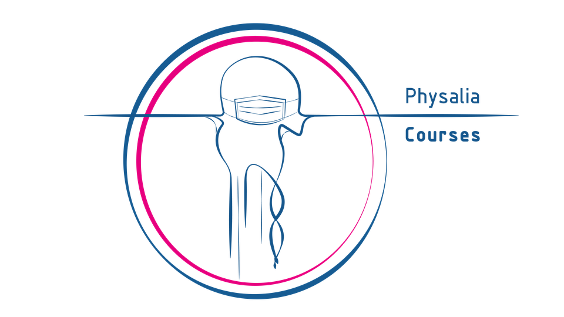

--- 
title: "Intro to R"
author: "Philip T. Leftwich"
date: "2023-01-03"
subtitle: Introduction to statistics in R for biologists and ecologists
site: bookdown::bookdown_site
documentclass: book
bibliography:
- book.bib
- packages.bib
biblio-style: apa
csl: include/apa.csl
link-citations: yes
description: |
  This book ...
url: https://ueabio.github.io/data-sci
github-repo: UEABIO/data-sci
cover-image: images/logos/twitter_card.png
apple-touch-icon: images/logos/apple-touch-icon.png
apple-touch-icon-size: 180
favicon: images/logos/favicon.ico
---

# Overview {-}

By the end of this book, you will be able to:

* Import data into R
* Manipulate and wrangle data into an appropriate format for analysis
* Calculate summaries of descriptive statistics
* Produce informative data visualisations
* Produce reports using R & Markdown
* Use GitHub to develop version control and data reproducibility skills
* Use General and Generalized Linear Models to produce mean estimates, uncertainty intervals and statistical tests. 

## How to use this book 

For many of the chapters, we will provide the code you need to use. You can copy and paste from the book, however, we strongly encourage you to type out the code by yourself. This will seem much slower and you will make errors, but you will learn much more quickly this way.

Additionally, we also provide the solutions to many of the activities. No-one is going to check whether you tried to figure it out yourself rather than going straight to the solution but remember this: if you copy and paste without thinking, you will learn nothing. 

Finally, on occasion we will make updates to the book such as fixing typos and including additional detail or activities and as such this book should be considered a living document. Please **tell me** if you find any mistakes. 

## Course Overview

This course will introduce scientists and practitioners interested in applying statistical approaches in their daily routine using R as a working environment. Participants will be introduced into the mysteries of R and R Studio while learning how to perform common statistical analyses. After a short introduction on R and its principles, the focus will be on questions that could be addressed using common statistical analyses, both for descriptive statistics and for statistical inference.

